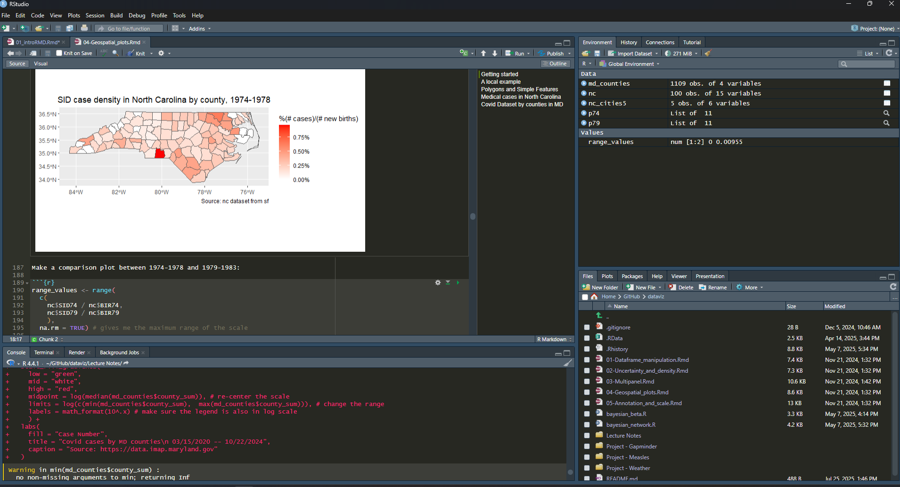
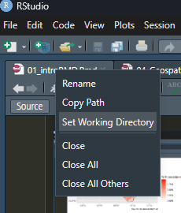

```{r setup, include=FALSE}
knitr::opts_chunk$set(echo = TRUE)
```


## Starting Texts (click the book titles for the links)

- Kieran Healy, [Data visualization: a practical introduction](https://socviz.co/)
- Hadley Wickham, Mine Çetinkaya-Rundel, and Garrett Grolemund, [R for data science](https://r4ds.had.co.nz/index.html) 
- Hadley Wickham, [ggplot2: Elegant Graphics for Data Analysis](https://ggplot2-book.org/)
- Winston Chang, [R Graphics Cookbook](https://r-graphics.org/)
- (Recommended for formatting your work) Xie, Yihui, Joseph J. Allaire, and Garrett Grolemund, [R markdown: 
The definitive guide](https://bookdown.org/yihui/rmarkdown)
- More as we go along (but all will be free)

## What is R?

R is a powerful open-source software system that provides an 
extensive and coherent collection of tools for statistics and 
data analysis.

-  Language and tools for representing and manipulating statistical 
models
- *POWERFUL* and *QUICK* graphic capabilities (esp. **ggplot2** package)
- Flexible object-oriented programming
- Large (and growing!) package libraries
- Versatile user-interface (**RStudio**)


## Download R


- *Step 1.* Download R: Go to <https://www.r-project.org/>. Feel free to use any suitable mirror. [Here](https://mirror.its.umich.edu/cran/) is the UMichigan mirror. 
- *Step 2.* Download RStudio <https://rstudio.com/products/rstudio/download/> and install RStudio Desktop. 

## Download R Studio


*NW*: write/run code, edit docs
*SW*: console, enter commands
*NE*: Find variables/command history
*SE*: display plots, **help**...


## Getting started with R: working directory

- Create a directory where you will save your R files, data, and figures. Set this to be your working directory by using
```
setwd("path/to/dir")
```
- Alternatively: 


## Getting Started with R: worksapce

- If you want to save everything in the current area as an R workspace, type
```
save.image("MyWorkspace.RData")
```

- To load a workspace, type
```
load("Myworkspace.RData")
```

- Note: Whenever you assign a variable name to an object, this object remains in your workspace until cleared or the variable name is reassigned (type `ls( )` or `objects` to see what you currently have defined in your workspace)


## Installing and loading R packages

- Much of the power of R comes from packages (how code is shared in the R community)

- To install packages, use:
```
install.packages(c("dplyr", "ggplot2"))
```

- To load packages, use
```
library("dplyr", "ggplot2")
```

- You can download packages straight for GitHub with the `devtool` package
```
devtools::install_github(
  "dpmcsuss/igraphmatch", ref = "dev"
)
```

- Sometimes you don't want to load the whole package just to use one function, so you use `::` like the example above:
```
PackageName::function(...)
```

## Installing all the necessary packages

- We will often work with *tidy* data and in the *tidyverse* (more on this later)

- To install (most of) the needed packages, type the following into your RStudio console
```
tidyverse_packages <- c("tidyverse", "broom", 
  "coefplot","cowplot","gapminder", "GGally", 
  "ggrepel", "ggridges", "gridExtra","here", 
  "interplot", "margins", "maps", "mapproj",
  "mapdata", "MASS", "quantreg", "rlang", "scales", 
  "survey", "srvyr", "viridis", "viridisLite", 
  "devtools")

install.packages(tidyverse_packages)
```

- The code above creates a vector/list of characters called `tidyverse_packages` using the most basic combine function `c()`

## Saving and Loading Files


  - To save an .RData file, use `save(filename, file = "directory")`
  ```
  save(X, file = ".../dataviz/Lecture Notes/MyData.RData")
  ```
  
  - We can load it with `load()'
  
  *--------*
  
  - To save/load a single R object, you can use `saveRDS()` and `readRDS()`
  - To save a file as a .csv, use `write.table()` or `fwrite()` (more on loading .csv later)
  - Many other formats. **GOOGLE** what you need
  
  
## (Down)loading Data

If data is stored at a remote site, you can download it as follows:

```{r}
pway <-  "https://cdn.rawgit.com/kjhealy/
viz-organdata/master/organdonation.csv"
organs <- readr::read_csv(pway)
```

- Web scrapes: read up on the `rvest` and `httr` packages and **GET** for more details on how to add options for website scrapes


## Loading data locally

- Let's save `organs` as a .csv file locally. \pause
```{r}
write.csv(organs, file = "data/organdonations.csv")
```
What I did here is that I saved the `organs` object as a .csv file called "organdonations.csv" in the *data* folder. You can also use the `write.csv()` function. Type `?write.csv()` for more. 

- To load the local csv file, we can do this:
```{r}
organs2 <- read.csv("data/organdonations.csv")
```


## Loading data

When you download a new dataset, it pays to take a look inside it using `str()`

```{r}
str(organs)
```

## Loading data

When you download a new dataset, it pays to take a look inside it using `str()`

```{r}
str(organs2)
```

## Digression: `organs` vs `organs2`

- Note that the two objects are different! `organs` is a `spec_tbl_df`(**Tibble**), while `organs2` is a `data.frame`. What caused this difference? \pause `read.csv()` vs `read_csv`. 

- **data.frame**: base R structure for tabular data, widely used and versatile. No meta data (such as column specifications). good for general-purpose R programming and legacy codebases.

- **Tibble**: A subclass of `data.frame` introduced by the `tibble` package, designed for better usability and modern workflows. Often includes additional metadata (good for data import/export). Ideal for tidyverse workflows (strict rules and predictable behaviors). 


## R Basics: names

- Everything in R has a name
  - variables (think `x` or `y`)
  - data you have loaded (`organs` and `organs 2`)
  - functions (`c()`, `install.packages()`)


- Avoid common function names when naming your variables
```
t(), q(), mean(), median(), sd(), rnorm(), c(), ...
```

- Names in R are case sensitive. **Convention**: convention: lowercase names, separate words with underscore `visualize_data()`

## R basics: expressions and assignments

Elementary commands consist of either **expressions** or **assignments**

- **Expressions:** executable commands; evaluated, printed then discarded
```{r}
sqrt(765)/5^4
```

- **Assignments:** Evaluate an expression and pass the value to a variable; result not usually printed. Use `<-`, `=` (or `->` but don't use this)
```{r}
number <- sqrt(765)/5^4
```


## R basics: Guess the output

- 
```
x <- 3+4
x + 5
```
\pause

- ```y <- 1:10``` \pause

- ```x + y```
\pause
```{r}
x <- 3+4
y <- 1:10
x + y
```


- The last phenomenon is usually referred to as *broadcasting*: the process of aligning the dimensions of two objects (like vectors, matrices, or arrays) so that operations can be performed element-wise, even when their dimensions differ (**not always possible**)


## Objects and Classes in R

**Everything in R is an object. Every object in R has a class.**

- R operates on objects:
  - vectors or lists
  - functions (more on this later)
  
- **\textcolor{red}{Lists}**: Composed of data-objects organized as strings or vectors; elements can be **\textcolor{red}{numerical}** (or complex)

```{r}
x <- c(1,2,3, 8:10)
str(x)
class(x)
```

## Boolean

- Boolean numbers: **T/F** $\leftrightarrow$ **1/0**

```{r}
x <- 2:7
y <- x > 3
str(y)
```

\pause

```{r}
z <- y + 5
z
class(z)
```
\pause

- R automatically converts `logi` (which is in principle T/F) to the more general `num` 

- We can define Boolean variables with `>`, `<`, `==`, `>=`, `<=`, `!=`


## Lists of Characters

- The following operations will produce an error. 
```
y <- c("Hello", "Data350")
z <- x + y 
```
- Any reasonable way to go though with the operation? \pause

```{r}
y <- c("Hello", "Data350")
z <- c(x,y)
str(z)
class(z)
```

- R automatically converts `num` to the more general `chr`


## Data frames

- **Data frames** (and **tibbles**): rectangular lists in R used to efficiently store/analyze/visualize complex data sets. Think **\textcolor{red}{spreadsheets}**


- Columns: variables/covariates/features

- Rows: Observations

- Access entries of the dataframe `X` using `X[rows_needed, col_needed]`

```{r}
library(ggplot2)
data("midwest")
midwest[c(1:4), c(2,3,5,18)]
```


## Do yourself a favor!

- Dataframes (and tibbles) are a key data structure for data visualization in R 

- It is important to keep your data frames (tibbles) **tidy**

- Each variable must have its own column

- Each observation must have its own row

- Each value must have its own cell

- Can be some work up front, but pays dividends down the line!


## Inspecting a dataframe

- We have used `str()`. Some other common options include
```
head(), tail(), slice_head(), slice_sample()
```

- For instance, the following selects 10 random observations from `midwest`.
```{r}
dplyr::slice_sample(midwest, n = 10)
```

## Inspecting a dataframe: column selection

- We have used `X[rows,columns]`, but it's not easy to count the column numbers

- Instead, we use `X$col_name` or `pull()`
```{r}
pd <- midwest$popdensity
str(pd)
```
```{r}
pd2 <- dplyr::pull(midwest, var = "popdensity")
str(pd2)
```
- At the moment, we only select one column at a time. More advanced functions later. 


## Plotting

```{r, out.width = "60%", fig.align='center'}
library(ggplot2)
p <- ggplot(midwest,aes(
              x = percollege, y = percadultpoverty))
p
```
In the previous slide, `p` is a graph object and follows the ``ggplot2`` syntax. We can build our graph systematically.

## Plotting

 At the moment, `p` is a blank canvas, but we can add a **layer** of scattered plot using `geom_point()`


```{r, out.width="70%", fig.align='center'}
p + geom_point(aes(col = state, size = popdensity))
```
- In the `aes` selection, we use colors to different states, and dot size to reflect population density. 


## Plotting a dataframe

Add **legends** and **labels** (I will be **\textcolor{red}{VERY HARSH}** about this in your grading rubric). 
```{r, echo = FALSE, out.height="70%", fig.align='center'}
p + geom_point(aes(col = state, size = popdensity)) + 
  labs(
    title = "Poverty and Education",
    x = "Percent College Educated",
    y = "Percent Adult Poverty", 
    caption = "Source: midwest dataset"
  ) +
  theme_bw()
```


