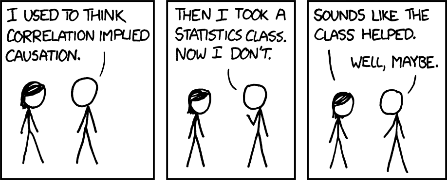

```{r setup, include=FALSE}
knitr::opts_chunk$set(echo = TRUE,  message = FALSE)
knitr::opts_chunk$set(fig.align='center', out.width = "80%")
library(gapminder)
library(ggplot2)
library(socviz)
library(tidyverse)
```





