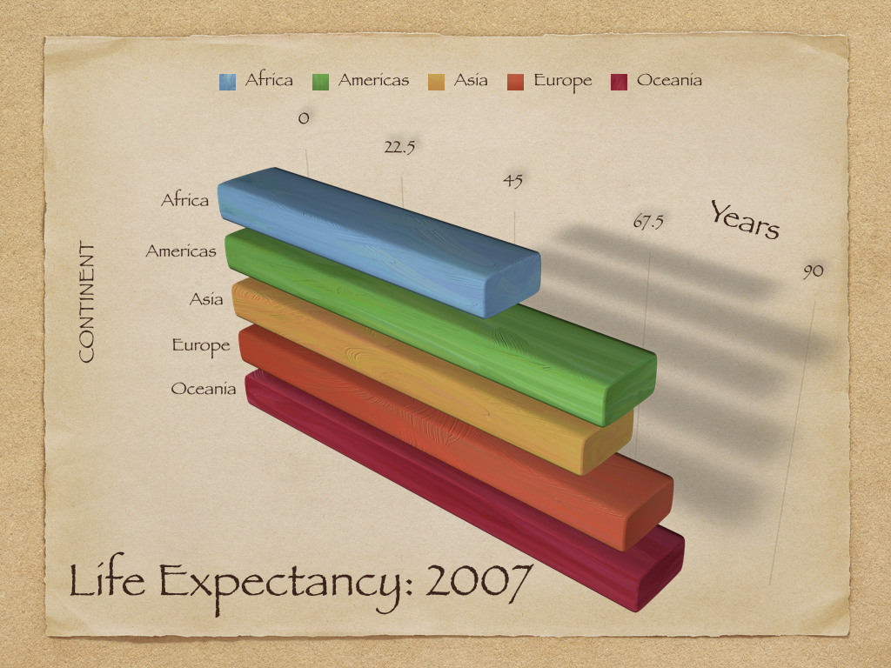
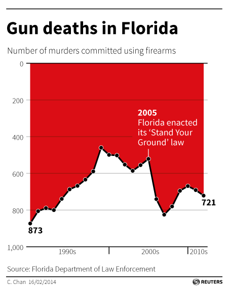
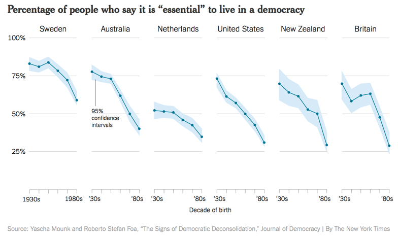
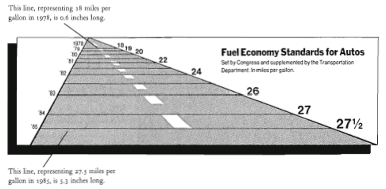
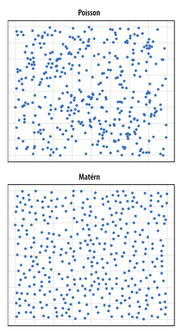

```{r setup, include=FALSE}
knitr::opts_chunk$set(echo = TRUE,  message = FALSE)
knitr::opts_chunk$set(fig.align='center', out.width = "75%")
library(ggplot2)
library(tidyverse)
```


```{r, echo = F, out.width="105%"}

```


# Principles of Modern Data Visualization


## An iconic infographic

```{r, fig.cap='Napoleon’s retreat from Moscow in 1812 by Minard', out.width="100%", echo = F}
knitr::include_graphics("images/02_minrad.png")
```

Charles Joseph Minard, 1781–1870, French civil Engineer, recognized for infographics in civil engineering and statistics, especially "flow maps".


## Graphics should **reveal** data

“Anscombe’s quartet” from Anscombe, Francis J. “Graphs in statistical analysis.” The American Statistician 27.1 (1973): 17-21. 

```{r}
str(anscombe)
```

## Anscombe's quartet

- A linear model on `x` and `y` (finding the best-fit line):
$$
Y = \beta_0 + \beta_1x + \mathsf{Noise}
$$
- Total of four sets $y_i \sim x_i$, $i = 1, 2, 3, 4$

```{r}
lm1 <- summary(lm(y1~x1, anscombe[, c(1,5)]))
lm2 <- summary(lm(y2~x2, anscombe[, c(2,6)]))
lm3 <- summary(lm(y3~x3, anscombe[, c(3,7)]))
lm4 <- summary(lm(y4~x4, anscombe[, c(4,8)]))
```


## Anscombe's quartet: linear models coefficients


```{r, echo = F}
lm1$coefficients
lm2$coefficients
lm3$coefficients
lm4$coefficients
```


## Anscombe's quartet, visualized

```{r, echo=F, fig.align='center', out.width="80%"}
set <- rep(1:4, each = 11)

Anscombe <- data.frame(
  X   = unlist(anscombe[, 1:4]),
  Y   = unlist(anscombe[, 5:8]),
  set = factor(set)
)
g_se <- ggplot(data = Anscombe, aes(x = X, y = Y)) +
  geom_point() +
  geom_smooth(aes(group = set), method = lm, se = TRUE, color = "red") +
  facet_wrap(~set) +
  ggtitle("Anscombe's Quartet") +
  theme_bw() +
  xlab("x") +
  ylab("y") +
  scale_y_continuous(breaks = seq(0, 12, 2))

g_se
```


## Real-life outliers


 

```{r, out.width="45%", fig.align='center', fig.cap='"The impact of outliers on income inequality" by Robert W. Jackman, in response to Hewitt (1977)', echo=FALSE}
knitr::include_graphics("images/02_jackman.png")
```


## What could go wrong? Data-to-Ink Ratio


\begin{columns}

\column{0.4\textwidth}

{\it The number of information-carrying (variable) dimensions depicted should not exceed the number of dimensions in the data.}
  
\column{0.65\textwidth}
```{r, fig.align='center', out.width="80%", echo = F, fig.cap='Forbes, Connected Cars By The Numbers 2015'}
knitr::include_graphics("images/02_forbes.png")
```


\end{columns}


## What could go wrong? Data-to-Ink Ratio


```{r, fig.align='center', out.width="80%", echo = F, fig.cap='Figure 1.4 in Healy, A chart with a considerable amount of junk. '}

```


## What could go wrong? Bad Model and Bad Data

- Much more likely to create a good looking figure out of bad data

- Good-looking, well-constructed plots displaying bad data can be problematic. [**Halo Effect**](https://en.wikipedia.org/wiki/Halo_effect)


```{r, fig.align='center', out.width="75%", echo = F, fig.cap='Source: https://www.tylervigen.com/spurious-correlations'}
knitr::include_graphics("images/02_spurious_correlation.png")
```


## What could go wrong? Bad Model and Bad Data

Graphics can't save you from bad models or bad data

```{r, fig.align='center', out.width="75%", echo = F, fig.cap=''}
knitr::include_graphics("images/02_solar_stock.jpg")
```


## Be Honest and Reproducible

\begin{columns}

\column{0.5\textwidth}

```{r, fig.align='center', out.width="85%", echo = F, fig.cap=''}

```

\footnotesize 
Source: Reuters

\column{0.5\textwidth}

```{r, fig.align='center', out.width="85%", echo = F, fig.cap=''}
knitr::include_graphics("images/02_gpt5.jpg")
```

\footnotesize 
Source: OpenAI announcement of GPT5


\end{columns}

## Plot Types and Honesty

```{r, fig.align='center', out.width="100%", echo = F, fig.cap=''}

```

- Misleading plot types? 
- Misleading usage of data? \pause The survey is on the scale of 0-10, the plot is for 10 only!


## Telling the truth about data


- "The **representation of numbers**, as physically measured on the surface of the graphic itself, should be directly proportional to the numerical quantities represented."

- "Clear, detailed, and thorough **labeling** should be used **to defeat graphical distortion and ambiguity.**  Write out explanations of the data on the graphic itself. Label important events in the data."

$$
\text{"Lie Factor"} = \frac{\text{Size of Effect Shown in Graphic}}{\text{Size of Effect in Data}}
$$
```{r, fig.align='center', out.width="55%", echo = F, fig.cap=''}

```
\footnotesize 
Source: page 57 of Tufte, Edward R. The visual display of quantitative information (2nd ed.).Cheshire, CT: Graphics press, 2001.


# Visualization using `R`

## Data Visualization in `R`

- What is `R`? 
  - Open-source software system, object-oriented
  - extensive toolbox for statistics and data analytics/visualization
  
  \pause
  
- Why `R` (and not PowerBI, for example)?
  - Reproducible workflow
  - Reproducible data **science** is good data **science**
  
  \pause

- Protagonists: `dplyr` and `ggplot2` 
  - `dplyr` handles data wrangling (cleaning, transformation etc.)
  - `ggplot2` handles graphics
  


## High-level syntax

Plots are composed of **data** and **mapping**
  
  - **data**: "tidy data":
    - Each variable has its column
    - Each observation has its row
    - Each cell has one value
  - **mapping**: how variables are mapped to the aesthetic attributes
  
\pause  
  
Components of **mapping**

- **Layers**: collections of geometric elements (`geom_`: what you see) and statistical transformations (`stats`: summaries of the data)

- **Scales**: map values (color, shape, size, etc...) in the data space to values in the aesthetic space. Note: `scale_` draws the legend and axes


## Case study: building a plot layer by layer using `gapminder`

```{r}
library(dplyr)
library(ggplot2)
library(gapminder)
glimpse(gapminder)
```


## How to Build Layers: `ggplot() + geom_`

```{r}
ggplot(
  data = gapminder,
  mapping = aes(x = gdpPercap, y = lifeExp)) + 
  geom_point()
```

## `scale_<aes>_<method>`

```{r}
ggplot(
  data = gapminder) + 
  geom_point(mapping = aes(x = gdpPercap, y = lifeExp)) + 
  scale_x_log10()
```


## Include more variables

```{r}
ggplot(gapminder,aes(x = gdpPercap, y = lifeExp)) + 
  geom_point(aes(color = continent)) + 
  scale_x_log10()
```


## Include more variables

```{r}
ggplot(gapminder,aes(x = gdpPercap, y = lifeExp)) + 
  geom_point(aes(color = continent, size = pop), 
             alpha = 0.7) + 
  scale_x_log10()
```


## Include statistical model

```{r}
ggplot(gapminder,aes(x = gdpPercap, y = lifeExp)) + 
  geom_point(aes(color = continent, size = pop), 
             alpha = 0.4) + 
  scale_x_log10() + 
  geom_smooth(aes(color = continent), method = "lm")
```

## Adjusting the statistical model

```{r}
p <- ggplot(gapminder,aes(x = gdpPercap, y = lifeExp)) + 
  geom_point(aes(color = continent, size = pop), 
             alpha = 0.4) + 
  scale_x_log10() + 
  geom_smooth(aes(color = continent, weight = pop),method = "lm")
p
```

## Alternative smoothing model

```{r}
ggplot(gapminder,aes(x = gdpPercap, y = lifeExp)) + 
  geom_point(aes(color = continent, size = pop), 
             alpha = 0.2) + 
  scale_x_log10() + 
  geom_smooth(aes(color = continent, weight = pop),
              method = "gam")
```


## Digression: `geom_smooth()`


- `gam` stands for [**generalized additive model**](https://en.wikipedia.org/wiki/Generalized_additive_model). It is the **default** when $>$ 1000 data points. 

- How GAM works? 
\[
g(\mathbb{E}[Y]) = c_0 + \sum_{i=1}^m f_i(x_i)
\]

- The choices include
  - `lm` [linear model](https://en.wikipedia.org/wiki/Linear_model) (most straightforward)
  - `glm` [generalized linear model](https://en.wikipedia.org/wiki/Generalized_linear_model)
  - `gam` [generalized additive model](https://en.wikipedia.org/wiki/Generalized_additive_model)(most flexible)
  - `loess` [locally estimated scatterplot smoothing](https://en.wikipedia.org/wiki/Local_regression) ($< 1000$ data points)


## Alternative smoothing model

```{r}
ggplot(gapminder,aes(x = gdpPercap, y = lifeExp)) + 
  geom_point(aes(color = continent, size = pop), 
             alpha = 0.2) + 
  scale_x_log10() + 
  geom_smooth(aes(color = continent, weight = pop),
              method = "glm")
```


## Digression: Communicating Uncertainty

- The grey band in `geom_smooth()` is by default the 95% CI
\[
\hat{y}_i \pm t_{\alpha/2, n-p-1}\sqrt{\mathrm{MSE}(X_i^t (X^t X) X_i)}
\]

- It can be turned off by setting `se = FALSE`. However, if not too messy, keep it on! (It conveys **uncertainty**!!)

- **The role of statistics (& data science) is not to transform uncertainty into certainty!**

- Good practice: Acknowledge and clearly present the level of uncertainty in the data


## Labels: every aesthetic element needs a label!


```{r gapminder with labels, out.width="60%", eval = T}
p_with_labels <- p + labs(
  x = "GDP Per Capita", 
  y = "Life Expectancy", 
  color = "Continent",
  size = "Population", 
  title = "Relationship Between Life Expectancy and GDP Per Capita", 
  caption = "Source: gapminder data")
```


## Labels: every aesthetic element needs a label!


```{r gapminder with labels display, out.width="100%"}
p_with_labels
```

## Labels for outliers

```{r}
library(ggrepel)
p + geom_text_repel(
  data = subset(gapminder, 
                gdpPercap > 30000 & lifeExp < 70),
  mapping = aes(label = country))
```


## Fine-tuning: themes, colors, axis labels, etc

```{r}
p + 
  scale_color_manual(
    values = c("#46745d", "tomato2", "blue", "tan3", "orchid2")) + 
  scale_x_log10(label = scales::dollar) + 
  ggthemes::theme_tufte()
```


## Example: boxplot with `gapminder`

```{r}
ggplot(subset(gapminder, year %in% c(1957, 2007))) + 
  geom_boxplot(
    aes(x = as.factor(year), y = lifeExp, color = continent)) + 
  ggthemes::theme_fivethirtyeight()
```


## How to read a boxplot


## Example: boxplot with `gapminder`

```{r}
ggplot(subset(gapminder, year %in% c(1957, 2007)),
       aes(x = as.factor(year), y = lifeExp, color = continent)) + 
  geom_boxplot() + 
  ggthemes::theme_fivethirtyeight()
```


## Advanced Example: Pairs Plot

```{r}
library(GGally)
gapminder |> select(-c("country", "year")) |> 
  ggpairs(aes(color = continent),
          diag = list(continuous = wrap("densityDiag", alpha= 0.5, color = NA)),
          upper = list(continuous = wrap("cor", size = 2.7)), 
          lower = list(continuous = wrap("points", size = 0.2, alpha = 0.8)))
```


## Be mindful about plotting

Who are my audiences? What plots and models? What visual elements? How many tick marks? Legend position? Theme?


\begin{columns}

\column{0.35\textwidth}
```{r, fig.align='center', out.width="85%", echo = F, fig.cap=''}

```

\column{0.75\textwidth}
```{r, fig.align='center', out.width="85%", echo = F, fig.cap=''}
knitr::include_graphics("images/02_gestalt2.png")
```
\end{columns}


## Graphical Excellence


In *The Visual Display of Quantitative Data*, Edward Tufte writes:

- Graphical excellence is the well-designed presentation of interesting data -- a matter of **substance**, of **statistics**, and of **design**. 

- Graphical excellence consists of complex ideas communicated with **clarity, precision, and efficiency**. 

- Graphical excellence is that which gives to the viewer the greatest number of ideas in the shortest time with the least ink in the smallest space. It is nearly always **multivariate**.

- And graphical excellence requires telling the truth about the data.


## Thank you for your attention!


