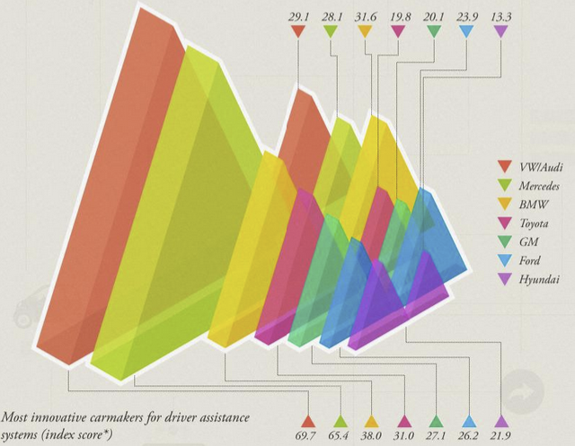
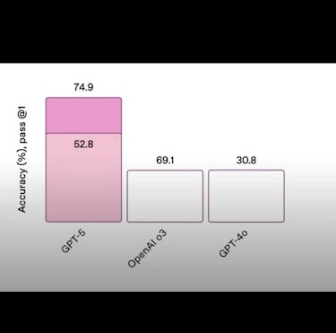

```{r setup, include=FALSE}
knitr::opts_chunk$set(echo = TRUE,  message = FALSE)
knitr::opts_chunk$set(fig.align='center', out.width = "75%")
library(ggplot2)
library(tidyverse)
```


```{r, echo = F, out.width="105%"}
knitr::include_graphics("images/futurama.png")
```


## Napoleon's retreat from Moscow, Charles Joseph Minard


## "Graphics **REVEAL** data" -- Tufte

“Anscombe’s quartet” from Anscombe, Francis J. “Graphs in statistical analysis.” The American Statistician 27.1 (1973): 17-21. 

```{r}
str(anscombe)
```

## Anscombe's quartet

A linear model on `x` and `y` (finding the best-fit line):
$$
Y = \beta_0 + \beta_1x + \mathsf{Noise}
$$
Total of four sets $y_i ~ x_i$, $i = 1, 2, 3, 4$

```{r}
lm1 <- summary(lm(y1~x1, anscombe[, c(1,5)]))
lm2 <- summary(lm(y2~x2, anscombe[, c(2,6)]))
lm3 <- summary(lm(y3~x3, anscombe[, c(3,7)]))
lm4 <- summary(lm(y4~x4, anscombe[, c(4,8)]))
```


## Anscombe's quartet: linear models coefficients


```{r, echo = F}
lm1$coefficients
lm2$coefficients
lm3$coefficients
lm4$coefficients
```


## Anscombe's quartet, visualized


```{r, echo= FALSE, out.width="85%", fig.align='center'}
library(ggplot2)

set <- rep(1:4, each = 11)

Anscombe <- data.frame(
  X   = unlist(anscombe[, 1:4]),
  Y   = unlist(anscombe[, 5:8]),
  set = factor(set)
)

g <- ggplot(data = Anscombe, aes(x = X, y = Y)) +
  geom_point() +
  geom_smooth(aes(group = set), method = lm, se = FALSE, color = "red") +
  facet_wrap(~set) +
  ggtitle("Anscombe's Quartet") +
  theme_bw() +
  xlab("x") +
  ylab("y") +
  scale_y_continuous(breaks = seq(0, 12, 2))

g
  
```

## Anscombe's quartet

```{r, echo=F, fig.align='center', out.width="80%"}
g_se <- ggplot(data = Anscombe, aes(x = X, y = Y)) +
  geom_point() +
  geom_smooth(aes(group = set), method = lm, se = TRUE, color = "red") +
  facet_wrap(~set) +
  ggtitle("Anscombe's Quartet") +
  theme_bw() +
  xlab("x") +
  ylab("y") +
  scale_y_continuous(breaks = seq(0, 12, 2))

g_se
```


## Outliers in correlation

- Anscombe’s quartet is artificial, but there are plenty of real-life examples. 

```{r, out.width="45%", fig.align='center', fig.cap='"The impact of outliers on income inequality" by Robert W. Jackman, in response to Hewitt (1977)', echo=FALSE}
knitr::include_graphics("images/02_jackman.png")
```

Source: Figure 1.2 in Healy


## Data-to-ink ratio


\begin{columns}

\column{0.4\textwidth}

{\it The number of information-carrying (variable) dimensions depicted should not exceed the number of dimensions in the data.}
  
\column{0.65\textwidth}
```{r, fig.align='center', out.width="80%", echo = F, fig.cap='Forbes: Connected Cars By The Numbers 2015'}

```


\end{columns}
[article link](https://www.forbes.com/sites/niallmccarthy/2015/01/27/connected-cars-by-the-numbers-infographic/#2298e8f01028)


## More Junks


```{r, fig.align='center', out.width="80%", echo = F, fig.cap='Figure 1.4 in Healy: A chart with a considerable amount of junk in it. '}
knitr::include_graphics("images/02_healy2.png")
```


## Bad Data

- Much more likely to create a good looking figure out of bad data

- Good-looking, well-constructed plots displaying bad data can be problematic. [**Halo Effect**](https://en.wikipedia.org/wiki/Halo_effect)


```{r, fig.align='center', out.width="75%", echo = F, fig.cap='Source: https://www.tylervigen.com/spurious-correlations'}
knitr::include_graphics("images/02_spurious_correlation.png")
```


## Bad Data

Graphics can't save you from bad models or bad data

```{r, fig.align='center', out.width="75%", echo = F, fig.cap=''}
knitr::include_graphics("images/02_solar_stock.jpg")
```


## Be Honest and Reproducible

\begin{columns}

\column{0.5\textwidth}

```{r, fig.align='center', out.width="85%", echo = F, fig.cap=''}
knitr::include_graphics("images/02_florida.png")
```

\footnotesize 
Source: Reuters

\column{0.5\textwidth}

```{r, fig.align='center', out.width="85%", echo = F, fig.cap=''}

```

\footnotesize 
Source: OpenAI announcement of GPT5


\end{columns}


## Telling the truth about data


- "The **representation of numbers**, as physically measured on the surface of the graphic itself, should be directly proportional to the numerical quantities represented."

- "Clear, detailed, and thorough **labeling** should be used **to defeat graphical distortion and ambiguity.**  Write out explanations of the data on the graphic itself. Label important events in the data."

$$
\text{"Lie Factor"} = \frac{\text{Size of Effect Shown in Graphic}}{\text{Size of Effect in Data}}
$$
```{r, fig.align='center', out.width="55%", echo = F, fig.cap=''}
knitr::include_graphics("images/02_liefactor.png")
```
\footnotesize 
Source: page 57 of Tufte, Edward R. The visual display of quantitative information (2nd ed.).Cheshire, CT: Graphics press, 2001.


# Visualization using `R`

## Data Visualization in `R`

- What is `R`? 
  - Open-source software system, object-oriented
  - extensive toolbox for statistics and data analytics/visualization
  
- Why `R` (and not PowerBI, for example)?
  - Reproducible workflow
  - Reproducible data **science** is good data **science**
  


