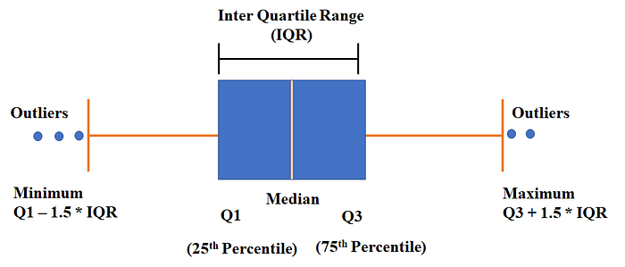

\begin{center}\includegraphics[width=1.05\linewidth]{images/futurama} \end{center}


## An iconic visualization example

\begin{figure}

{\centering \includegraphics[width=1\linewidth]{images/02_minrad} 

}

\caption{Charles Joseph Minard: Napoleon’s retreat from Moscow in 1812}\label{fig:unnamed-chunk-2}
\end{figure}


# Principles of Modern Data Visualization


## Graphics **reveal** data

“Anscombe’s quartet” from Anscombe, Francis J. “Graphs in statistical analysis.” The American Statistician 27.1 (1973): 17-21. 


``` r
str(anscombe)
```

```
## 'data.frame':	11 obs. of  8 variables:
##  $ x1: num  10 8 13 9 11 14 6 4 12 7 ...
##  $ x2: num  10 8 13 9 11 14 6 4 12 7 ...
##  $ x3: num  10 8 13 9 11 14 6 4 12 7 ...
##  $ x4: num  8 8 8 8 8 8 8 19 8 8 ...
##  $ y1: num  8.04 6.95 7.58 8.81 8.33 ...
##  $ y2: num  9.14 8.14 8.74 8.77 9.26 8.1 6.13 3.1 9.13 7.26 ...
##  $ y3: num  7.46 6.77 12.74 7.11 7.81 ...
##  $ y4: num  6.58 5.76 7.71 8.84 8.47 7.04 5.25 12.5 5.56 7.91 ...
```

## Anscombe's quartet

- A linear model on `x` and `y` (finding the best-fit line):
$$
Y = \beta_0 + \beta_1x + \mathsf{Noise}
$$
- Total of four sets $y_i \sim x_i$, $i = 1, 2, 3, 4$


``` r
lm1 <- summary(lm(y1~x1, anscombe[, c(1,5)]))
lm2 <- summary(lm(y2~x2, anscombe[, c(2,6)]))
lm3 <- summary(lm(y3~x3, anscombe[, c(3,7)]))
lm4 <- summary(lm(y4~x4, anscombe[, c(4,8)]))
```


## Anscombe's quartet: linear models coefficients


```
##              Estimate Std. Error  t value    Pr(>|t|)
## (Intercept) 3.0000909  1.1247468 2.667348 0.025734051
## x1          0.5000909  0.1179055 4.241455 0.002169629
```

```
##             Estimate Std. Error  t value    Pr(>|t|)
## (Intercept) 3.000909  1.1253024 2.666758 0.025758941
## x2          0.500000  0.1179637 4.238590 0.002178816
```

```
##              Estimate Std. Error  t value    Pr(>|t|)
## (Intercept) 3.0024545  1.1244812 2.670080 0.025619109
## x3          0.4997273  0.1178777 4.239372 0.002176305
```

```
##              Estimate Std. Error  t value    Pr(>|t|)
## (Intercept) 3.0017273  1.1239211 2.670763 0.025590425
## x4          0.4999091  0.1178189 4.243028 0.002164602
```


## Anscombe's quartet, visualized


\begin{center}\includegraphics[width=0.8\linewidth]{sample_lecture_files/figure-beamer/unnamed-chunk-6-1} \end{center}


## Real-life outliers


 

\begin{figure}

{\centering \includegraphics[width=0.45\linewidth]{images/02_jackman} 

}

\caption{"The impact of outliers on income inequality" by Robert W. Jackman, in response to Hewitt (1977)}\label{fig:unnamed-chunk-7}
\end{figure}

Source: Figure 1.2 in Healy


## Data-to-ink ratio


\begin{columns}

\column{0.4\textwidth}

{\it The number of information-carrying (variable) dimensions depicted should not exceed the number of dimensions in the data.}
  
\column{0.65\textwidth}
\begin{figure}

{\centering \includegraphics[width=0.8\linewidth]{images/02_forbes} 

}

\caption{Forbes, Connected Cars By The Numbers 2015}\label{fig:unnamed-chunk-8}
\end{figure}


\end{columns}


## More Junks


\begin{figure}

{\centering \includegraphics[width=0.8\linewidth]{images/02_healy2} 

}

\caption{Figure 1.4 in Healy, A chart with a considerable amount of junk. }\label{fig:unnamed-chunk-9}
\end{figure}


## Bad Data

- Much more likely to create a good looking figure out of bad data

- Good-looking, well-constructed plots displaying bad data can be problematic. [**Halo Effect**](https://en.wikipedia.org/wiki/Halo_effect)


\begin{figure}

{\centering \includegraphics[width=0.75\linewidth]{images/02_spurious_correlation} 

}

\caption{Source: https://www.tylervigen.com/spurious-correlations}\label{fig:unnamed-chunk-10}
\end{figure}


## Bad Data

Graphics can't save you from bad models or bad data

\begin{figure}

{\centering \includegraphics[width=0.75\linewidth]{images/02_solar_stock} 

}

\end{figure}


## Be Honest and Reproducible

\begin{columns}

\column{0.5\textwidth}

\begin{figure}

{\centering \includegraphics[width=0.85\linewidth]{images/02_florida} 

}

\end{figure}

\footnotesize 
Source: Reuters

\column{0.5\textwidth}

\begin{figure}

{\centering \includegraphics[width=0.85\linewidth]{images/02_gpt5} 

}

\end{figure}

\footnotesize 
Source: OpenAI announcement of GPT5


\end{columns}

## Plot Types and Honesty

\begin{figure}

{\centering \includegraphics[width=1\linewidth]{images/02_democracy} 

}

\end{figure}

- Misleading plot types? 
- Misleading usage of data? \pause The survey is on the scale of 0-10, the plot is for 10 only!


## Telling the truth about data


- "The **representation of numbers**, as physically measured on the surface of the graphic itself, should be directly proportional to the numerical quantities represented."

- "Clear, detailed, and thorough **labeling** should be used **to defeat graphical distortion and ambiguity.**  Write out explanations of the data on the graphic itself. Label important events in the data."

$$
\text{"Lie Factor"} = \frac{\text{Size of Effect Shown in Graphic}}{\text{Size of Effect in Data}}
$$
\begin{figure}

{\centering \includegraphics[width=0.55\linewidth]{images/02_liefactor} 

}

\end{figure}
\footnotesize 
Source: page 57 of Tufte, Edward R. The visual display of quantitative information (2nd ed.).Cheshire, CT: Graphics press, 2001.


# Visualization using `R`

## Data Visualization in `R`

- What is `R`? 
  - Open-source software system, object-oriented
  - extensive toolbox for statistics and data analytics/visualization
  
  \pause
  
- Why `R` (and not PowerBI, for example)?
  - Reproducible workflow
  - Reproducible data **science** is good data **science**
  
  \pause

- Protagonists: `dplyr` and `ggplot2` 
  - `dplyr` handles data wrangling (cleaning, transformation etc.)
  - `ggplot2` handles graphics
  


## High-level syntax

Plots are composed of **data** and **mapping**
  
  - **data**: "tidy data":
    - Each variable has its column
    - Each observation has its row
    - Each cell has one value
  - **mapping**: how variables are mapped to the aesthetic attributes
  
\pause  
  
Components of **mapping**

- **Layers**: collections of geometric elements (`geom_`: what you see) and statistical transformations (`stats`: summaries of the data)

- **Scales**: map values (color, shape, size, etc...) in the data space to values in the aesthetic space. Note: `scale_` draws the legend and axes


## Case study: building a plot layer by layer using `gapminder`


``` r
library(dplyr)
library(ggplot2)
library(gapminder)
glimpse(gapminder)
```

```
## Rows: 1,704
## Columns: 6
## $ country   <fct> "Afghanistan", "Afghanistan", "Afghanistan", "Afghanistan", ~
## $ continent <fct> Asia, Asia, Asia, Asia, Asia, Asia, Asia, Asia, Asia, Asia, ~
## $ year      <int> 1952, 1957, 1962, 1967, 1972, 1977, 1982, 1987, 1992, 1997, ~
## $ lifeExp   <dbl> 28.801, 30.332, 31.997, 34.020, 36.088, 38.438, 39.854, 40.8~
## $ pop       <int> 8425333, 9240934, 10267083, 11537966, 13079460, 14880372, 12~
## $ gdpPercap <dbl> 779.4453, 820.8530, 853.1007, 836.1971, 739.9811, 786.1134, ~
```


## Basic syntax and Layers


``` r
ggplot(
  data = gapminder,
  mapping = aes(x = gdpPercap, y = lifeExp)) + 
  geom_point()
```


\begin{center}\includegraphics[width=0.75\linewidth]{sample_lecture_files/figure-beamer/unnamed-chunk-17-1} \end{center}

## Scales


``` r
ggplot(
  data = gapminder,
  mapping = aes(x = gdpPercap, y = lifeExp)) + 
  geom_point() + 
  scale_x_log10()
```


\begin{center}\includegraphics[width=0.75\linewidth]{sample_lecture_files/figure-beamer/unnamed-chunk-18-1} \end{center}


## Include more variables


``` r
ggplot(gapminder,aes(x = gdpPercap, y = lifeExp)) + 
  geom_point(aes(color = continent)) + 
  scale_x_log10()
```


\begin{center}\includegraphics[width=0.75\linewidth]{sample_lecture_files/figure-beamer/unnamed-chunk-19-1} \end{center}


## Include more variables


``` r
ggplot(gapminder,aes(x = gdpPercap, y = lifeExp)) + 
  geom_point(aes(color = continent, size = pop), 
             alpha = 0.7) + 
  scale_x_log10()
```


\begin{center}\includegraphics[width=0.75\linewidth]{sample_lecture_files/figure-beamer/unnamed-chunk-20-1} \end{center}


## Include statistical model


``` r
ggplot(gapminder,aes(x = gdpPercap, y = lifeExp)) + 
  geom_point(aes(color = continent, size = pop), 
             alpha = 0.4) + 
  scale_x_log10() + 
  geom_smooth(aes(color = continent), method = "lm")
```


\begin{center}\includegraphics[width=0.75\linewidth]{sample_lecture_files/figure-beamer/unnamed-chunk-21-1} \end{center}

## Adjusting the statistical model


``` r
p <- ggplot(gapminder,aes(x = gdpPercap, y = lifeExp)) + 
  geom_point(aes(color = continent, size = pop), 
             alpha = 0.4) + 
  scale_x_log10() + 
  geom_smooth(aes(color = continent, weight = pop),method = "lm")
p
```


\begin{center}\includegraphics[width=0.75\linewidth]{sample_lecture_files/figure-beamer/unnamed-chunk-22-1} \end{center}

## Alternative smoothing model


``` r
ggplot(gapminder,aes(x = gdpPercap, y = lifeExp)) + 
  geom_point(aes(color = continent, size = pop), 
             alpha = 0.2) + 
  scale_x_log10() + 
  geom_smooth(aes(color = continent, weight = pop),
              method = "gam")
```


\begin{center}\includegraphics[width=0.75\linewidth]{sample_lecture_files/figure-beamer/unnamed-chunk-23-1} \end{center}


## Digression: `geom_smooth()`


- `gam` stands for [**generalized additive model**](https://en.wikipedia.org/wiki/Generalized_additive_model). It is the **default** when $>$ 1000 data points. 

- How GAM works? 
\[
g(\mathbb{E}[Y]) = c_0 + \sum_{i=1}^m f_i(x_i)
\]

- The choices include
  - `lm` [linear model](https://en.wikipedia.org/wiki/Linear_model) (most straightforward)
  - `glm` [generalized linear model](https://en.wikipedia.org/wiki/Generalized_linear_model)
  - `gam` [generalized additive model](https://en.wikipedia.org/wiki/Generalized_additive_model)(most flexible)
  - `loess` [locally estimated scatterplot smoothing](https://en.wikipedia.org/wiki/Local_regression) ($< 1000$ data points)


## Digression: Communicating Uncertainty

- The grey band in `geom_smooth()` is by default the 95% CI
\[
\hat{y}_i \pm t_{\alpha/2, n-p-1}\sqrt{\mathrm{MSE}(X_i^t (X^t X) X_i)}
\]

- It can be turned off by setting `se = FALSE`. However, if not too messy, keep it on! (It conveys **uncertainty**!!)

- **The role of statistics (& data science) is not to transform uncertainty into certainty!**

- Good practice: Acknowledge and clearly present the level of uncertainty in the data


## Labels: every aesthetic element needs a label!


``` r
p <- p + labs(
  x = "GDP Per Capita", 
  y = "Life Expectancy", 
  color = "Continent",
  size = "Population", 
  title = "Relationship Between Life Expectancy and GDP Per Capita", 
  caption = "Source: gapminder data")
```


## Labels: every aesthetic element needs a label!


``` r
p
```


\begin{center}\includegraphics[width=1\linewidth]{sample_lecture_files/figure-beamer/unnamed-chunk-25-1} \end{center}

## Labels for outliers


``` r
library(ggrepel)
p + geom_text_repel(
  data = subset(gapminder, gdpPercap > 30000 & lifeExp < 70),
  mapping = aes(label = country))
```


\begin{center}\includegraphics[width=0.75\linewidth]{sample_lecture_files/figure-beamer/unnamed-chunk-26-1} \end{center}


## Fine-tuning: themes, colors, axis labels, etc


``` r
p + 
  scale_color_manual(
    values = c("#46745d", "tomato2", "blue", "tan3", "orchid2")) + 
  scale_x_log10(label = scales::dollar) + 
  ggthemes::theme_tufte()
```


\begin{center}\includegraphics[width=0.75\linewidth]{sample_lecture_files/figure-beamer/unnamed-chunk-27-1} \end{center}


## Example: boxplot with `gapminder`


``` r
ggplot(subset(gapminder, year %in% c(1957, 2007))) + 
  geom_boxplot(
    aes(x = as.factor(year), y = lifeExp, color = continent)) + 
  ggthemes::theme_fivethirtyeight()
```


\begin{center}\includegraphics[width=0.75\linewidth]{sample_lecture_files/figure-beamer/unnamed-chunk-28-1} \end{center}


## How to read a boxplot




## Example: boxplot with `gapminder`


``` r
ggplot(subset(gapminder, year %in% c(1957, 2007)),
       aes(x = as.factor(year), y = lifeExp, color = continent)) + 
  geom_boxplot() + 
  ggthemes::theme_fivethirtyeight()
```


\begin{center}\includegraphics[width=0.75\linewidth]{sample_lecture_files/figure-beamer/unnamed-chunk-29-1} \end{center}


## Advanced Example: Pairs Plot


``` r
library(GGally)
gapminder |> select(-c("country", "year")) |> 
  ggpairs(aes(color = continent),
          diag = list(continuous = wrap("densityDiag", alpha= 0.5, color = NA)),
          upper = list(continuous = wrap("cor", size = 2.7)), 
          lower = list(continuous = wrap("points", size = 0.2, alpha = 0.8)))
```


\begin{center}\includegraphics[width=0.75\linewidth]{sample_lecture_files/figure-beamer/unnamed-chunk-30-1} \end{center}


## Be mindful about plotting

Who are my audiences? What plots and models? What visual elements? How many tick marks? Legend position? Theme?


\begin{columns}

\column{0.35\textwidth}
\begin{figure}

{\centering \includegraphics[width=0.85\linewidth]{images/02_gestalt1} 

}

\end{figure}

\column{0.75\textwidth}
\begin{figure}

{\centering \includegraphics[width=0.85\linewidth]{images/02_gestalt2} 

}

\end{figure}
\end{columns}


## Graphical Excellence


In *The Visual Display of Quantitative Data*, Edward Tufte writes:

- Graphical excellence is the well-designed presentation of interesting data -- a matter of **substance**, of **statistics**, and of **design**. 

- Graphical excellence consists of complex ideas communicated with **clarity, precision, and efficiency**. 

- Graphical excellence is that which gives to the viewer the greatest number of ideas in the shortest time with the least ink in the smallest space. It is nearly always **multivariate**.

- And graphical excellence requires telling the truth about the data.


## Thank you for your attention!


