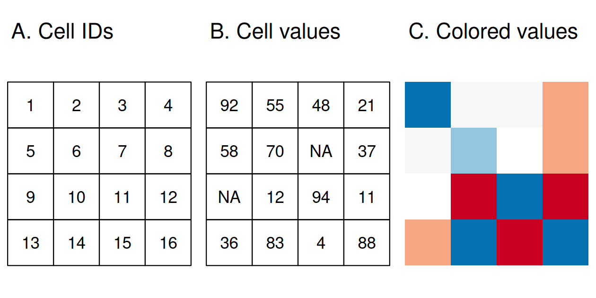
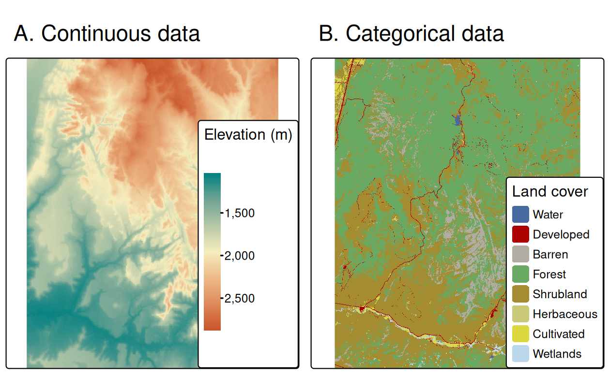
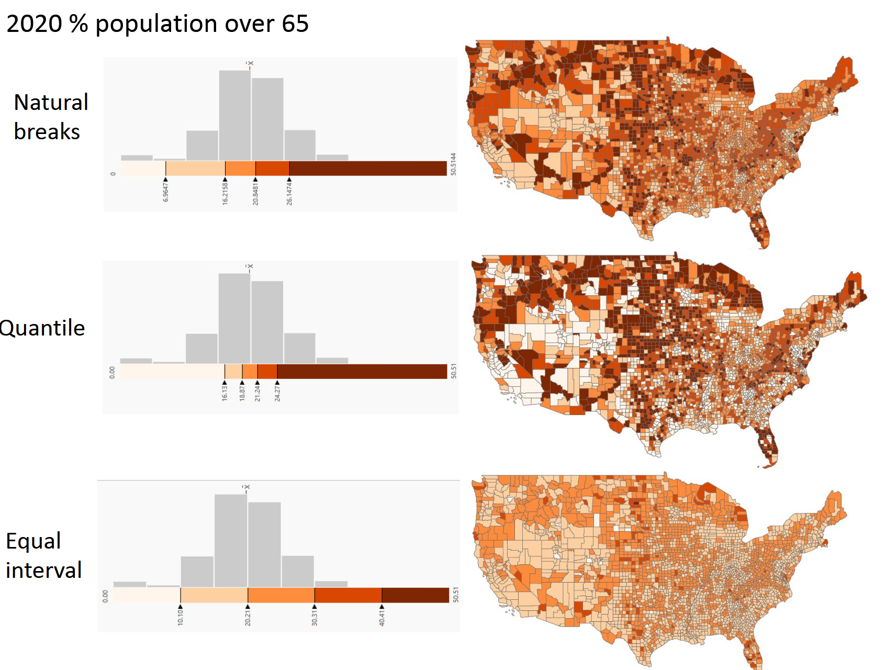

```{r setup, include=FALSE}
knitr::opts_chunk$set(echo = TRUE,  message = FALSE)
knitr::opts_chunk$set(fig.align='center', out.width = "100%")
library(ggplot2)
library(tidyverse)
library(maps)
library(sf)
library(terra)
```


## References

This set of slides is mostly based on 

- Chapter 6 of [ggplot2: Elegant Graphics for Data Analysis (3e)](https://ggplot2-book.org/maps.html)
- Chapter 7 of [Data Visualization: A Practical Introduction](https://socviz.co/maps.html#maps)

More in-depth reading:

- [Geocomputation with R](https://r.geocompx.org/) by Lovelace, Nowosad, and Muenchow


## Data type: vector data

**Vector data**: points --> line segments & polygons (ordered points and line segments)


\tiny\flushright
Source: Geocomputation with R Chapter 2

## Data type: raster data

**Raster data**: pixels, (raster head + a matrix)


\tiny\flushright
Source: Geocomputation with R Chapter 2


## Choice of colors

- Discrete vs continuous scales? 
- "Bad" vs "Good" vs "Neutral"?

```{r, echo = F, out.width="78%"}

```
\tiny\flushright 
Source: Geocomputation with R Chapter 2


## Choice of colors

How to choose break points?

```{r, echo = F, out.width="78%"}

```
\tiny\flushright 
Source: MIT Open Courseware


## Getting started

```{r, eval = F}
install.packages("maps")
install.packages("sf")
install.packages("spData")
library(maps) # lightweight, old
library(sf) # working with vector data
library(spData) # spatial datasets
```

When you are by yourself with a lots of electricity and time (to install and potentially debug):
```{r, eval = F}
install.packages("terra")
install.packages("spDataLarge", repos = "https://geocompr.r-universe.dev")
```


```{r, echo = F}
library(maps)
library(sf)
library(ggplot2)
library(spData)
```


## Mapping basics: US domestic


```{r}
maps::map("state", fill = T, col = palette())
```

**Caution:** the color can only be specified by `col`.  


## Mapping basics: World

Many of them do not have internal state boundaries


```{r}
maps::map("world", region = "Spain")
# Try Canada, Australia, Brazil, Italy, Japan, France, UK
```

## Mapping basics: World

```{r}
maps::map("world", regions = "canada")
```


##

```{r}
maps::map("world", regions = "")
```


## Preloaded color palettes


```{r}
maps::map("state", fill = TRUE, col = rainbow(49))
# maps::map("state", fill = TRUE, col = terrain.colors(49))
# the number here tells you how many colors in the palette to use
```

##

```{r}
# maps::map("state", fill = TRUE, col = rainbow(49))
maps::map("state", fill = TRUE, col = heat.colors(49, alpha = 0.7))
```


## A local example

```{r}
map("county", "maryland",
  fill = TRUE,
  col = heat.colors(10, alpha = 0.5))
```


## Example with `spData`

- Documentation: <https://jakubnowosad.com/spData/>

```{r}
names(spData::world)
spData::world |> slice_sample(n=5)
```

## Example with `spData`

```{r}
spData::world |> 
  slice_sample(n=20) |>
  plot()
```

## Example with `spData`

```{r}
plot(world["pop"])
```

## `spData`

```{r}
plot(spData::us_states)
```
## `spData`

```{r}
plot(urban_agglomerations)
```


##  `spData` 

```{r, eval = F}
gdp_breaks <- quantile(world$gdpPercap/1000, 
                       probs = seq(0, 1, 0.25), na.rm = TRUE)
ggplot(subset(world, !is.na(gdp_bin))) + 
  geom_sf(aes(fill = gdpPercap/1000)) + 
  scale_fill_gradient(
    breaks = gdp_breaks, 
    low = "white", high = "red", 
    label = round(gdp_breaks)) + 
  ggthemes::theme_map()
```
##  `spData` 

```{r, echo = F}
gdp_breaks <- quantile(world$gdpPercap/1000, 
                       probs = seq(0, 1, 0.25), na.rm = TRUE)
ggplot(subset(world, !is.na(gdpPercap))) + 
  geom_sf(aes(fill = gdpPercap/1000)) + 
  scale_fill_gradient(
    breaks = gdp_breaks, 
    low = "white", high = "red", 
    label = round(gdp_breaks)) + 
  ggthemes::theme_map()
```


## Discrete scales

```{r, eval = F}
gdp_breaks <- quantile(world$gdpPercap/1000, 
                       probs = seq(0, 1, 0.25), na.rm = TRUE)
world$gdp_bin <- cut(world$gdpPercap/1000, 
                     breaks = gdp_breaks, include.lowest = T)
color_bin <- colorRampPalette(c("white", "red"), bias = 5)(4)
ggplot(subset(world, !is.na(gdp_bin))) + 
  geom_sf(aes(fill = gdp_bin)) + 
  scale_fill_manual(
    values = color_bin) + 
  ggthemes::theme_map()
```

## Discrete scales

```{r, echo = F}
gdp_breaks <- quantile(world$gdpPercap, 
                       probs = seq(0, 1, 0.25), na.rm = TRUE)
world$gdp_bin <- cut(world$gdpPercap, 
                     breaks = gdp_breaks, include.lowest = F)
color_bin <- colorRampPalette(c("white", "red"), bias = 5)(4)
ggplot(subset(world, !is.na(gdp_bin))) + 
  geom_sf(aes(fill = gdp_bin)) + 
  scale_fill_manual(
    values = color_bin, 
    labels = round(gdp_breaks, -4)) + 
  ggthemes::theme_map()
```


## Extracting geospatial info via `ggplot2::map_data`


```{r}
head(map_data("county", "maryland"))
```


## Exercise

-   Create a new dataframe called `md_counties` by
-   selecting the columns containing longitude, latitude, group, and subregion and
-   changing the name of `long` to `lon` and `subregion` to `id`.

\pause

```{r}
md_counties <- map_data("county", "maryland") |>
      select(
        lon = long,
        lat,
        group,
        id = subregion)
str(md_counties)
```

    
## Exercise, continued

- Create a scatterplot of `md_counties` to see what each coordinates represent. 
- Make sure to add a layer `coord_quickmap()` for better spatial geometry.
    
```{r md_counties scatterplot, out.width="70%"}
ggplot(md_counties,
       aes(x = lon, y = lat)) + 
  geom_point(size = 0.2, aes(color = id)) + 
  coord_quickmap() + # line up longitude with latitude
  labs(x = "Longitude", y = "Latitude", color = "County")
```


## Polygons and Simple Features

The key to complete the map is the `geom_polygon()` function.

-   allows us to draw polygons around objects by group

-   connect the boundary points of a region using lines

```{r, out.width = "70%"}
ggplot(md_counties, 
       aes(lon, lat, group = id)) + 
  geom_polygon(color = "white", aes(fill = id)) +
  coord_quickmap() + theme_void() 
```

## Simple Feature

What if the data is not lat/lon for boundaries?

-   often map data is vectorized and encoded using the “simple features” standard of the **Open Geospatial Consortium**
-   the *sf* (simple feature) package allows us to handle this

```{r}
# install.packages("sf")
library(sf)
```


## Example: North Carolina SID

```{r}
nc <- st_read(
  system.file("shape/nc.shp", package = "sf"),
  quiet = TRUE)
nc
```

## Example: North Carolina SID

Key layers: `geom_sf()` and `coord_sf()`

```{r}
ggplot(nc) + 
  geom_sf() + # plots the polygon
  coord_sf() # line up the longitudes
```

## 

The variable "SID74" is the number of sudden infant death in the period 1974-78. You can plot this by county by specifying the *fill* aesthetics in *geom_sf()*. Adjust the colors using *scale_fill_gradient()*

```{r sid total}
ggplot(nc) + 
  geom_sf(aes(fill = SID74)) + coord_sf() + 
  scale_fill_gradient(low = "white",high = "red") + 
    ggthemes::theme_map() 
# a personal preference: ggthemes::theme_map()
# + labels
```


## Example: SID

Total deaths vs death rates? Modify the previous chunk to plot the death rate instead. Make sure to specify `labels = scales::label_percent()`

\pause


```{r, eval = F}
ggplot(nc) + 
  geom_sf(aes(fill = (SID74/BIR74))) + 
  coord_sf() + 
  scale_fill_gradient(
    low = "white",
    high = "red",
    labels = scales::label_percent()) + 
  labs(
    title = "SID case density in North Carolina by county, 1974-1978",
    caption = "Source: nc dataset from sf",
    fill = "%(# cases)/(# new births)") + 
  theme(plot.title = element_text(hjust = 0.5))
```

##

```{r sid death rate, echo = F}
ggplot(nc) + 
  geom_sf(aes(fill = (SID74/BIR74))) + 
  coord_sf() + 
  scale_fill_gradient(
    low = "white",
    high = "red",
    labels = scales::label_percent()) + 
  labs(
    title = "SID case density in North Carolina by county, 1974-1978",
    caption = "Source: nc dataset from sf",
    fill = "Death rate among newbirths") + 
  theme(plot.title = element_text(hjust = 0.5))
```

## Comparison between 

**Exercise:** Make a comparison plot between 1974-1978 and 1979-1983 (call them `p74` and `p79`)

\pause

```{r sid 74 vs sid 79}
p74 <- ggplot(nc) + 
  geom_sf(aes(fill = (SID74/BIR74))) + coord_sf() + 
  scale_fill_gradient(
    low = "white", high = "red",
    labels = scales::label_percent())
p79 <- ggplot(nc) + 
  geom_sf(aes(fill = (SID79/BIR79))) + 
  coord_sf() + 
  scale_fill_gradient(
    low = "white", high = "red",
    labels = scales::label_percent())
```


## Comparison via `patchwork`

```{r sid comparison}
library(patchwork)
p74 / p79 & ggthemes::theme_map()
```

Anything misleading about the plot?

## Fixing the scales

```{r sid 74 vs sid 79 fixed scales}
range_values <- range(
  c(nc$SID74 / nc$BIR74, nc$SID79 / nc$BIR79), 
  na.rm = TRUE)
p74 <- ggplot(nc) + 
  geom_sf(aes(fill = (SID74/BIR74))) + 
  coord_sf() + 
  scale_fill_gradient(
    low = "white",
    high = "red",
    labels = scales::label_percent(),
    limits = range_values)
p79 <- ggplot(nc) + 
  geom_sf(aes(fill = (SID79/BIR79))) + 
  coord_sf() + 
  scale_fill_gradient(
    low = "white",
    high = "red",
    labels = scales::label_percent(),
    limits = range_values)
```


## Comparison via `patchwork`

```{r sid comparison fixed scales}
library(patchwork)
p74 / p79 & ggthemes::theme_map()
```


## Example: SID

**Exercise:** how to create a single plot showing improvement/worsening between the two quinquennia? `scale_fill_gradient2` may be useful

\pause

```{r, eval = F}
ggplot(nc) + 
  geom_sf(aes(fill = (SID79/BIR79)-(SID74/BIR74))) + 
  coord_sf() + 
  scale_fill_gradient2(
    low = "green",
    mid = "white",
    high = "red",
    labels = scales::label_percent()) +  ggthemes::theme_map()
```

## 

```{r sid improvement, echo = F}
ggplot(nc) + 
  geom_sf(aes(fill = (SID79/BIR79)-(SID74/BIR74))) + 
  coord_sf() + 
  scale_fill_gradient2(
    low = "green",
    mid = "white",
    high = "red",
    labels = scales::label_percent())+ggthemes::theme_map()
```

## Example: SID

Add some texts to the plot using `ggrepel`

```{r}
library(ggrepel)
```


Import another dataset from maps:

```{r}
library(ggrepel)
library(tidyverse)
# select the top five populous city in NC
nc_cities5 <- maps::us.cities |> filter(country.etc == "NC") |> arrange(desc(pop)) |> slice_head(n=5)
nc_cities5 
```

## Labeling the cities


```{r, eval = F}
ggplot() + 
  geom_sf(
    data = nc,
    mapping = aes(fill = (SID79/BIR79)-(SID74/BIR74))) + 
  coord_sf() + 
  scale_fill_gradient2(
    low = "green",mid = "white",high = "red",
    labels = scales::label_percent()) + 
  geom_point(
    data = nc_cities5, 
    mapping = aes(x = long, y = lat),
    size = 2, color = "purple") + 
  geom_text_repel(
    data = nc_cities5,
    mapping = aes(x = long, y = lat, label = name),
    color = "black", size = 2.5)+ggthemes::theme_map()
```

## 
```{r, echo = F}
ggplot() + 
  geom_sf(
    data = nc,
    mapping = aes(fill = (SID79/BIR79)-(SID74/BIR74))) + 
  coord_sf() + 
  scale_fill_gradient2(
    low = "green",mid = "white",high = "red",
    labels = scales::label_percent(),
    name = "Rate Increase") + 
  geom_point(
    data = nc_cities5, 
    mapping = aes(x = long, y = lat),
    size = 2, color = "purple") + 
  geom_text_repel(
    data = nc_cities5,
    mapping = aes(x = long, y = lat, label = name),
    color = "black", size = 2.5) + 
  labs(title = "SID rate improvement from 74-79 to 79-81",
       caption = "Source: nc dataset") + 
  ggthemes::theme_map() + 
  theme(
    legend.position = "right",
    )
```


## Covid Dataset by counties in MD


Download the dataset from <https://data.imap.maryland.gov/datasets/maryland::mdcovid19-casesbycounty/about/>

```{r}
mdcovid <- read.csv("data/MDCOVID19_CasesByCounty.csv")
head(mdcovid, 2)
tail(mdcovid, 2)
```


## Covid Dataset by counties in MD


Say we are interested in the total number of cases throughout the period of the survey, we need to take column sum:

```{r defining county_sum}
county_sum <- colSums(mdcovid[, -c(1,2)]) # not summing the first (ID) or the second (timestamp) columns
county_sum
```
## 

```{r}
names(county_sum)
```
## Aligning two dataframes

Need to align `county_sum` and `md_counties`. Let's work on the side of `county_sum`, so we remove `_` from mdcovid and make everything lower-case:

```{r alignment}
names(county_sum) <- tolower(names(county_sum)) 
names(county_sum) <- sub("_", " ", names(county_sum)) 
names(county_sum)
```
## 

```{r}
county_sum <- filter(data.frame(county_sum), county_sum!= 0)
tail(county_sum)
```


## Joining the dataset

Create a new column called `id` to match with `md_counties`

```{r}
county_sum$id <- rownames(county_sum)
county_sum
```

## Joining the dataset

Spread the county number according to id using `left_join`

```{r}
md_counties <- left_join(
  md_counties,
  county_sum,
  by = "id")
# md_counties$case_num <- md_counties$county_sum
head(md_counties)
```


## **Exercise:** Finish plotting the total cases

\pause

```{r, eval = F}
library(scales)
ggplot(md_counties,
       aes(lon, lat, group = group)) + 
  geom_polygon(aes(fill = log(county_sum)), # using a log scale here
               color = "black", linewidth = 0.2) + 
  coord_quickmap() + 
  scale_fill_gradient2(
    low = "green", 
    mid = "white", 
    high = "red",
    midpoint = log(median(md_counties$county_sum)), 
    limits = log(c(min(md_counties$county_sum), 
                   max(md_counties$county_sum))), 
    labels = math_format(10^.x)) + 
  labs(
    fill = "Case Number",
    title = "Covid cases by MD counties\n 03/15/2020 -- 10/22/2024",
    caption = "Source: https://data.imap.maryland.gov") + 
  ggthemes::theme_map()
```

## 

```{r, echo = F}
library(scales)
ggplot(md_counties,
       aes(lon, lat, group = group)) + 
  geom_polygon(aes(fill = log(county_sum)), # using a log scale here
               color = "black", linewidth = 0.2) + 
  coord_quickmap() + 
  scale_fill_gradient2(
    low = "green", 
    mid = "white", 
    high = "red",
    midpoint = log(median(md_counties$county_sum)), 
    limits = log(c(min(md_counties$county_sum), 
                   max(md_counties$county_sum))), 
    labels = math_format(10^.x)) + 
  labs(
    fill = "Case Number",
    title = "Covid cases by MD counties\n 03/15/2020 -- 10/22/2024",
    caption = "Source: https://data.imap.maryland.gov") + ggthemes::theme_map()
```


## Where to go from here (a lot of places)

```{r, eval = F}
# install.packages("leaflet")
library(leaflet)
popup = c("Data350")
leaflet() |>
  addProviderTiles("NASAGIBS.ViirsEarthAtNight2012") |>
  addMarkers(lng = c(-77),lat = c(39), 
             popup = popup)
```


