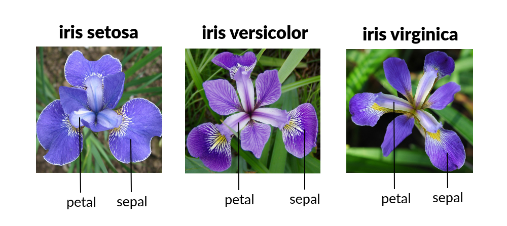
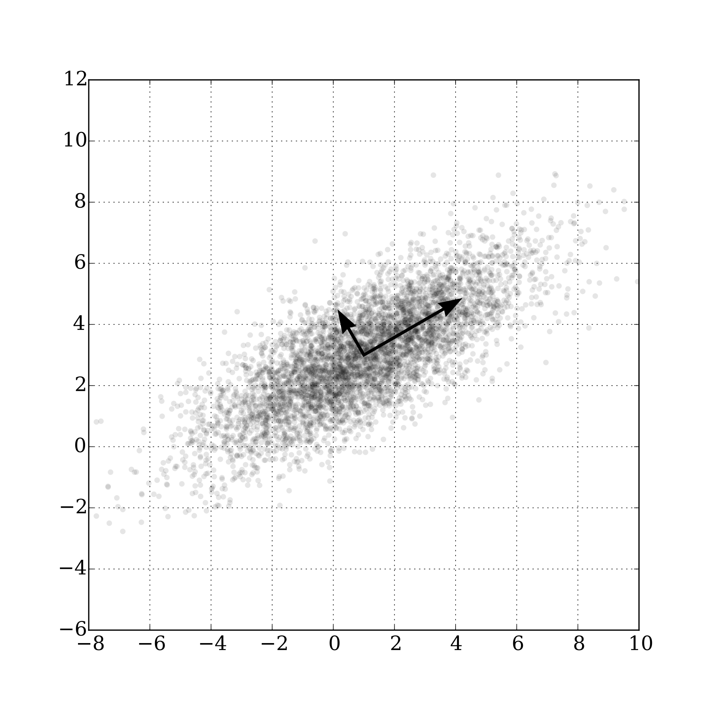

```{r setup, include=FALSE}
knitr::opts_chunk$set(echo = TRUE,  message = FALSE)
knitr::opts_chunk$set(fig.align='center', out.width = "65%")
library(ggplot2)
library(tidyverse)
library(patchwork)
library(ggcorrplot)
library(corrplot)
library(GGally)
```


## The `iris` dataset

```{r}
X <- iris3
dim(X)
head(X)
```
## Just so we have a picture


\tiny
Source: medium.com


## Slicing a multi-dimensional array

```{r}
X_setosa <- X[ , , 1]
head(X_setosa)
```

## row-binding (reshaping) using `rbind()`

```{r}
X_iris3 <- rbind(iris3[,,1], iris3[,,2], iris3[,,3])
str(X_iris3)
```


## Creating a dataframe

```{r}
df <- data.frame(X_iris3)
# create a new variable called `species`
df$species <- c(rep("setosa", 50), 
                rep("versicolor", 50), 
                rep("virginica", 50))
slice_sample(df, n = 5)
```


## Pairs Plot via `GGally:ggpairs`


```{r, out.width="90%"}
ggpairs(df)
```

## Customizing `ggpairs`

Let's remove the `species` column first
```{r, out.width="90%"}
ggpairs(df, columns = 1:4)
```


## Customizing `ggpairs`

```{r, out.width = "100%"}
ggpairs(df, columns = 1:4, aes(color = species))
```

## Further customization, `upper`, `lower`, `diag`
\tiny
```{r}
ggpairs(df, columns = 1:4, 
        aes(color = species),
        diag = list(continuous = wrap("densityDiag", alpha= 0.3)),
        upper = list(continuous = wrap("cor", size = 2.7)), 
        lower = list(continuous = wrap("points", size = 0.2, alpha = 0.8)))
```

## Discrete + Continuous features


```{r, eval = F}
ggpairs(df, columns = c(1,2,3,5), 
        aes(color = species),
        diag = list(
          continuous = wrap("densityDiag", alpha= 0.3)),
        upper = list(
          continuous = wrap("cor", size = 2.7)), 
        lower = list(
          continuous = wrap("points", size = 0.2, alpha = 0.8))) + 
  theme(
    axis.text.x = element_text(angle = 90, vjust = 0.5),
    axis.text.y = element_text(size = 4))
```

## Discrete + Continuous features


```{r, echo = F, out.width = "100%"}
ggpairs(df, columns = c(1,2,3,5), 
        aes(color = species),
        diag = list(continuous = wrap("densityDiag", alpha= 0.3)),
        upper = list(continuous = wrap("cor", size = 2.7)), 
        lower = list(continuous = wrap("points", size = 0.2, alpha = 0.8))) + 
  theme(
    axis.text.x = element_text(angle = 90, vjust = 0.5),
    axis.text.y = element_text(size = 4))
```


## Principal Component Analysis (PCA)

- **Manifold Hypothesis:** real life high-dimensional data concentrates about a lower-dimensional "surface"

- PCA: Very popular linear **dimension reduction techniques**


- Say each observation has $p$ features, and in total $n$ observations, so the data matrix $\mathbf{X} \in \mathbb{R}^{n\times p}$. 

- Oftentimes $p \gg 1$, and many features are highly-correlated

- **Q1:** how do we visualize high-dimensional data?

- **Q2:** how do we see the "most relevant" features and not redundancy?

- PCA provides an answer


## PCA

- **Goal:** Find \textcolor{red}{low-dimensional representation} of $mathbf{X}$ while keeping as much \textcolor{blue}{information/variation} as possible. 


- **Mental Picture** (Source: Wikipedia)

```{r, echo = F, out.width="60%"}

```


## A little math

- Write $\mathbf{X}_{n\times p} = (X_1 | \cdots | X_p)$, and assume `sum(X_i) = 0` (column-centered)

- From linear algebra: the matrix $\mathbf{X}^\top \mathbf{X}$ is a **positive-semidefinite matrix** and admits an orthogonal spectral sequence 


- The first principal component is an **eigenvector of the covariance matrix** $S = \tfrac{1}{n} \mathbf{X}^\top \mathbf{X}$ corresponding to the largest eigenvalue.

- Equivalently, this is the same as solving for
a unit vector $w_1 \in \mathbb{R}^p$ that maximizes the variance of the projected data:
$$
w_1 = \arg\max_{\|w\|=1} \; \|\mathbf{X}w\|^2 = \arg\max_{\|w\|=1} \; w^\top \mathbf{X}^\top \mathbf{X} X w.
$$


## A little math

- What about subsequent principal components?

- After finding the first $k-1$ principal components $w_1, \cdots, w_{k-1}$, we find the next one by solving
$$
w_k = \arg\max_{\|w\|=1, \; w \perp w_1,\ldots,w_{k-1}} \; w^\top \mathbf{X}^\top \mathbf{X} w.
$$
- The additional constraint states that it is orthogonal (i.e. **independent, and hence, uncorrelated**) to all previous components.


## Last bit of math

- In practice, people compute PCA via **S**ingular **V**alue **D**ecomposition (SVD)

- The SVD of the centered data matrix is

$$
\mathbf{X}_{n\times p} = U_{n\times n} \Sigma_{n\times p} V^\top_{p\times p}
$$
where  
  - $U $ has orthonormal columns (left singular vectors),  
  - $\Sigma$ is rectangular diagonal with nonnegative singular values,  
  - $V$ has orthonormal columns (right singular vectors).  


- The **principal component directions** are the columns of $V$ (right singular vectors).  
- The **principal component scores** (the data projected onto these directions) are given by $XV = U \Sigma$.  
- The **variance explained** by the $k$-th component is proportional to $\sigma_k^2$, where $\sigma_k$ is the $k$-th singular value.


## PCA in `R`

Back to the iris dataset
```{r}
X_iris3 <- data.frame(rbind(iris3[,,1], iris3[,,2], iris3[,,3]))
X_iris3$species <- c(rep("setosa", 50), 
                rep("versicolor", 50), 
                rep("virginica", 50))
str(X_iris3)
```

## PCA on `iris`

```{r}
X_iris_std <- scale(X_iris3[,1:4], center = T, scale = T)
pca.iris <- prcomp(X_iris_std, scale = T, retx = T)
pca.iris
```

## PCA on `iris`

```{r}
summary(pca.iris)
```

## Visualizing the PCA on `iris`

```{r}
pc <- data.frame(pca.iris$x);
pc$species = X_iris3$species
ggpairs(pc, columns = 1:4)
```

## After some fine-tuning

```{r, echo = F, out.width = "100%"}
ggpairs(pc, columns = c(1,2,3,5), 
        aes(color = species),
        diag = list(continuous = wrap("densityDiag", alpha= 0.3)),
        upper = list(continuous = wrap("cor", size = 2.7)), 
        lower = list(continuous = wrap("points", size = 0.2, alpha = 0.8))) + 
  theme(
    axis.text.x = element_text(angle = 90, vjust = 0.5),
    axis.text.y = element_text(size = 4))
```
## 


## Visualizing project via `biplot`, option 1

```{r}
factoextra::fviz_pca_biplot(pca.iris, 
                            label = "var", 
                            habillage = X_iris3$species) + 
  ggthemes::theme_solarized(light = F) + 
  ggtitle("Biplot via factoextra")
```

## Visualizing project via `biplot`, option 2

```{r}
ggbiplot::ggbiplot(pca.iris,
                   ellipse = T, circle = T, 
                   ellipse.linewidth = 0.4, point.size = 0.4,
                   groups = X_iris3$species,
                   obs.scale = 1, var.scale = 1) + 
  ggthemes::theme_clean() + ggtitle("Biplot via ggbiplot")
```

## Reading the `ggbiplot` (loading plot)

```{r, echo = F}
ggbiplot::ggbiplot(pca.iris,circle = T, 
                   point.size = 0.4, circle.prob = 0.75,
                   obs.scale = 1, var.scale = 1) + ggthemes::theme_clean()
```

- The projected lengths onto PC1 and PC2 correspond to the weight of the coefficients (called **loading**)
- The plots says petal length and width mostly align PC1, Sepal width and sepal length both contribute negatively to PC2
- **Possible Interpretation:** PC1 captures petal l/w and a good chunk of sepal length, while PC2 mostly captures sepal width and a bit of sepal length


