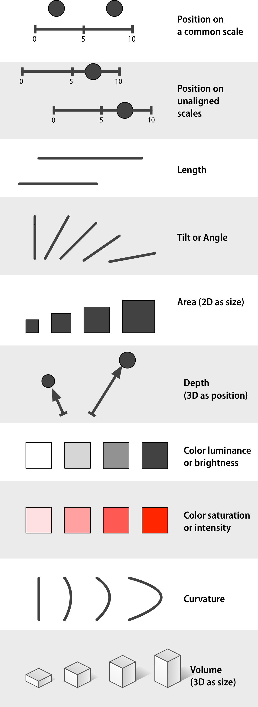

```{r setup, include=FALSE}
knitr::opts_chunk$set(echo = TRUE)
```


## Graphical Excellence


In *The Visual Display of Quantitative Data*, Edward Tufte writes:

- Graphical excellence is the well-designed presentation of interesting data—a matter of **substance**, of **statistics**, and of **design**. 

- Graphical excellence consists of complex ideas communicated with **clarity, precision, and efficiency**. 

- Graphical excellence is that which gives to the viewer the greatest number of ideas in the shortest time with the least ink in the smallest space.

- Graphical excellence is nearly always **multivariate**.

- And graphical excellence requires telling the truth about the data."


## The most famous data visualization plot


# Graphics Reveal Data


## "Graphics **REVEAL** data" -- Tufte

Consider “Anscombe’s quartet” from Anscombe, Francis J. “Graphs in statistical analysis.” The American Statistician 27.1 (1973): 17-21. See `?anscombe`

```{r}
str(anscombe)
```

## Anscombe's quartet

Let's run a linear model on `x` and `y` (finding the best-fit line). Total of four sets $y_i ~ x_i$, $i = 1, 2, 3, 4$

```{r}
lm1 <- summary(lm(y1~x1, anscombe[, c(1,5)]))
lm2 <- summary(lm(y2~x2, anscombe[, c(2,6)]))
lm3 <- summary(lm(y3~x3, anscombe[, c(3,7)]))
lm4 <- summary(lm(y4~x4, anscombe[, c(4,8)]))
```


## Small Digression

- R is a statistics powerhouse! Regression, testing, CI...

- `lm()` is R's built-in linear regression function

- To build models of the form
$$
Y = \beta_0 + \beta_1x_1 + \cdots + \beta_px_p + \epsilon
$$
the syntax is simply
```
lm(y ~ x1 + x2 + ... + xp, data = MyData, ...)
```

## Anscombe's quartet: linear models coefficients
\tiny
```{r, out.width="60%"}
lm1$coefficients
lm2$coefficients
lm3$coefficients
lm4$coefficients
```


## Anscombe's quartet

The code is suppressed. See the R Markdown file. 

```{r, echo= FALSE, out.width="85%", fig.align='center'}
library(ggplot2)

set <- rep(1:4, each = 11)

Anscombe <- data.frame(
  X   = unlist(anscombe[, 1:4]),
  Y   = unlist(anscombe[, 5:8]),
  set = factor(set)
)

g <- ggplot(data = Anscombe, aes(x = X, y = Y)) +
  geom_point() +
  geom_smooth(aes(group = set), method = lm, se = FALSE, color = "red") +
  facet_wrap(~set) +
  ggtitle("Anscombe's Quartet") +
  theme_bw() +
  xlab("x") +
  ylab("y") +
  scale_y_continuous(breaks = seq(0, 12, 2))

g
  
```

## Anscombe's quartet

```{r, echo=F, fig.align='center', out.width="80%"}
g_se <- ggplot(data = Anscombe, aes(x = X, y = Y)) +
  geom_point() +
  geom_smooth(aes(group = set), method = lm, se = TRUE, color = "red") +
  facet_wrap(~set) +
  ggtitle("Anscombe's Quartet") +
  theme_bw() +
  xlab("x") +
  ylab("y") +
  scale_y_continuous(breaks = seq(0, 12, 2))

g_se
```


## The Tidyverse

Reiterate: whenever possible, make your data frames (tibbles) **tidy**:

- Each variable must have its own column

- Each observation must have its own row

- Each value must have its own cell


Can be some work up front, but it pays to preprocess the data!


## Outliers in correlation

- Anscombe’s quartet is artificial, but there are plenty of real-life examples. See Figure 1.2 in Healy. 

```{r, out.width="45%", fig.align='center', fig.cap='"The impact of outliers on income inequality" by Robert W. Jackman, in response to Hewitt (1977)', echo=FALSE}
knitr::include_graphics("images/02_jackman.png")
```


## Data pattern hidden in correlation

```{r, out.width="65%", fig.align='center', echo=FALSE, fig.cap='An exercise by Jan Vanhove (2016) (Figure 1.3 in Healy)',}
knitr::include_graphics("images/02_healy.png")
```


# What is bad?

## Good vs Bad?


Good graphics (**in conjunction with good data analysis**) can illuminate data, revealing important trends that are hard to see from numeric summaries alone

\begin{columns}

\column{0.48\textwidth}

What makes a figure good or bad??
  
\begin{itemize}
\item Bad taste?

\item Bad data?

\item Bad perception?
\end{itemize}
  
\column{0.6\textwidth}
```{r, fig.align='center', out.width="80%", echo = F, fig.cap='Source: OpenAI announcement of GPT5'}
knitr::include_graphics("images/02_gpt5.jpg")
```


\end{columns}


  
  
## Tufte's principles

- Clean up typeface

- Remove extraneous colors and backgrounds

- Simplify superfluous marks (axes, gridlines, etc.)

- maximize “data-to-ink” ratio

Follow the principle (within reason)!


## Tufte's principles


\begin{columns}

\column{0.4\textwidth}

{\it The number of information-carrying (variable) dimensions depicted should not exceed the number of dimensions in the data.}
  
\column{0.65\textwidth}
```{r, fig.align='center', out.width="80%", echo = F, fig.cap='Forbes: Connected Cars By The Numbers 2015'}
knitr::include_graphics("images/02_forbes.png")
```


\end{columns}
[article link](https://www.forbes.com/sites/niallmccarthy/2015/01/27/connected-cars-by-the-numbers-infographic/#2298e8f01028)


## More Junks


```{r, fig.align='center', out.width="80%", echo = F, fig.cap='Figure 1.4 in Healy: A chart with a considerable amount of junk in it. '}
knitr::include_graphics("images/02_healy2.png")
```


## Tufte's principles (Tufte, 1983, p. 51)

- Graphical excellence is the well-designed presentation of interesting data -- a matter of substance, of statistics, and of design … 

- [It] consists of complex ideas communicated with clarity, precision, and efficiency. … 

- [It] is that which gives to the viewer the greatest number of ideas in the shortest time with the least ink in the smallest space … 

- [It] is nearly always multivariate … And graphical excellence requires telling the truth about the data. 


## More good principles: Time-series data

\small
Tufte: In time-series displays of money, deflated and standardized units of monetary measurement are nearly always better than nominal units.

```{r, fig.align='center', out.width="85%", echo = F, fig.cap='Source: https://people.duke.edu/~rnau/411infla.htm'}
knitr::include_graphics("images/02_timeseries.png")
```


## Special Cases

\begin{columns}

\column{0.48\textwidth}

\begin{itemize}

\item However...there is evidence that (well-executed) highly embellished "chartjunk" can be effective!

\item Not easier to interpret, but more memorable

\item No recipe for this
\end{itemize}

\column{0.6\textwidth}

```{r, fig.align='center', out.width="80%", echo = F, fig.cap='`Monstrous Costs’ by Nigel Holmes'}

```


\end{columns}


## Too minimalistic?

```{r, fig.align='center', out.width="75%", echo = F}

```

Visual cues (labels, gridlines, embellishing data points, etc.) can be very helpful


## Digression (Tufte's theme using `ggtheme`)

```{r, out.width="100%", fig.align='center', echo=FALSE}
library(ggplot2)
library(ggthemes)
library(patchwork)

# Base plot
p <- ggplot(cars, aes(x = speed, y = dist)) +
  geom_point(color = "steelblue", size = 2)

# Two themed versions
p_bw <- p + labs(title = "Speed vs Stopping Distance, default theme",
       x = "Speed (mph)",
       y = "Stopping distance (ft)")
p_tufte <- p + labs(title = "Speed vs Stopping Distance, theme_tufte()",
       x = "Speed (mph)",
       y = "Stopping distance (ft)") + 
  theme_tufte()

# Combine into 1x2 grid
p_bw + p_tufte
```


## Bad Data

- Much more likely to create a good looking figure out of bad data

- Good-looking, well-constructed plots displaying bad data can be problematic. [**Halo Effect**](https://en.wikipedia.org/wiki/Halo_effect)


```{r, fig.align='center', out.width="75%", echo = F, fig.cap='Source: https://www.tylervigen.com/spurious-correlations'}

```


## Bad Data

Graphics can't save you from bad models or bad data

```{r, fig.align='center', out.width="75%", echo = F, fig.cap=''}

```


## Democracy, oh democracy

\small
 "In your everyday work ... [y]ou are much more likely to make a good-looking, well-designed figure that misleads people because you have used it to display some bad data." -- Healy


```{r, fig.align='center', out.width="75%", echo = F, fig.cap=''}
knitr::include_graphics("images/02_democracy.png")
```

- Cross-sectional survey of people of different ages rather than a longitudinal study measuring everyone at different times

- the lines do not show a trend measured each decade from the 1930s, but rather differences in the answers given by people born in different decades

\normalsize

- **What plot will be more appropriate?**


## Democracy, continued


- Even misleading:  the survey question asked respondents to rate the importance of living in a democracy **\textcolor{red}{on a ten point scale}**

- The graph showed the difference across ages of people who had given a score of “10” only

\pause

```{r, fig.align='center', out.width="65%", echo = F, fig.cap='Redrawn by Erik Voeten using the average response'}

```


## Bad Perception

- The effectiveness of visual data displays depends on how our eyes perceive geometric shapes and relationships

- Hard to read 3d, over-embellishing, distortion...

- People tend to forgot because they want (have) to impress their supervisor

```{r, fig.align='center', out.width="65%", echo = F, fig.cap='Source: https://animalia-life.club/'}

```


## Bad Perception

We are not very good at comparing area! 

```{r, fig.align='center', out.width="65%", echo = F, fig.cap='Source: https://statisticsglobe.com/'}

```


## Perception and Data Visualization

Generally speaking, we are more sensitive to monochrome edges


\begin{columns}

\column{0.5\textwidth}
```{r, fig.align='center', out.width="65%", echo = F, fig.cap='Figure 1.16 in Healy'}

```

\column{0.5\textwidth}
```{r, fig.align='center', out.width="65%", echo = F, fig.cap='Figure 1.16 in Healy'}

```
\end{columns}


## Perception and Data Visualization

Brightness are relative

```{r, fig.align='center', out.width="65%", echo = F, fig.cap='Figure 1.14 in Healy'}

```

```{r, fig.align='center', out.width="65%", echo = F, fig.cap='Figure 1.15 in Healy'}

```


## Perception and Data Visualization

$$
\text{Color Differences} 
\quad \gg \quad 
\text{Shape Differences}
$$

```{r, fig.align='center', out.width="100%", echo = F, fig.cap='Figure 1.18 in Healy'}

```

Void color cominations hard to see for audience with color vision deficiency (see <http://mkweb.bcgsc.ca/colorblind/palettes.mhtml#page-container>)


## Perceptions and Data Visualization

```{r, fig.align='center', out.width="100%", echo = F, fig.cap='HEaly Figure 1.19: Multiple channels become uninterpretable very fast (left), unless your data has a great deal of structure (right)'}

```


## Gestalt Rules

We tend to group things together (perhaps erroneously) based on

- Proximity: spatially close
- Similarity: look alike
- Connection: visually tied to one another
- Continuity: Partially hidden objects are completed into familiar shapes.
- Closure: Incomplete shapes are perceived as complete
- Figure and ground: Visual elements are taken to be either in the foreground or in the background
- Common fate: Elements sharing a direction of movement are perceived as a unit


## Gestalt Rules


\begin{columns}

\column{0.35\textwidth}
```{r, fig.align='center', out.width="85%", echo = F, fig.cap='Figure 1.20 in Healy'}
knitr::include_graphics("images/02_gestalt1.png")
```

\column{0.75\textwidth}
```{r, fig.align='center', out.width="85%", echo = F, fig.cap='Figure 1.21 in Healy'}

```
\end{columns}


## Visual decoding of information


```{r, fig.align='center', out.width="85%", echo = F, fig.cap=''}
knitr::include_graphics("images/02_vis_decode.png")
```

\begin{columns}

\column{0.75\textwidth}

```{r, fig.align='center', out.width="65%", echo = F, fig.cap=''}
knitr::include_graphics("images/02_vis_decode2.png")
```

\column{0.3\textwidth}

{\tiny
From Healy Figure 1.22 \& 1.23. Schematic representation of basic perceptual tasks for nine chart types, by Heer and Bostock, following Cleveland and McGill. Participants were asked to make comparisons of highlighted portions of each chart type, and say which was smaller.
}


\end{columns}


## Study by by Cleveland and McGill (reinforced by Heer and Bostock 2010)

\begin{columns}

\column{0.5\textwidth}

From easiest to hardest:

1. Position along a common scale
2. Positions along nonaligned scales 
3. Length, direction, angle
4. Area
5. Volume
6. Color saturation

\column{0.5\textwidth}

```{r, fig.align='center', out.width="55%", echo = F, fig.cap=''}

```


\tiny
From Figure 1.24: Channels for mapping ordered data (continuous or other quantitative measures), arranged top-to-bottom from more to less effective, after Munzer (2014, 102).


\end{columns}


## Be Honest and Reproducible

\begin{columns}

\column{0.5\textwidth}

```{r, fig.align='center', out.width="85%", echo = F, fig.cap=''}
knitr::include_graphics("images/02_florida.png")
```

\footnotesize 
Source: https://graphics.thomsonreuters.com/14/02/US-FLORIDA0214.gif

\column{0.5\textwidth}

```{r, fig.align='center', out.width="85%", echo = F, fig.cap=''}

```

\footnotesize 
Source: page 43 of Tufte, The visual display of quantitative information (2nd ed.). Cheshire, CT: Graphics press, 2001

\end{columns}


## Telling the truth about data

Tufte, as well as the the guiding principle behind grading:

- "The representation of numbers, as physically measured on the surface of the graphic itself, should be directly proportional to the numerical quantities represented."

- "Clear, detailed, and thorough labeling should be used to defeat graphical distortion and ambiguity.  Write out explanations of the data on the graphic itself. Label important events in the data."

$$
\text{"Lie Factor"} = \frac{\text{Size of Effect Shown in Graphic}}{\text{Size of Effect in Data}}
$$
```{r, fig.align='center', out.width="55%", echo = F, fig.cap=''}
knitr::include_graphics("images/02_liefactor.png")
```
\footnotesize 
Source: page 57 of Tufte, Edward R. The visual display of quantitative information (2nd ed.).Cheshire, CT: Graphics press, 2001.


## Example of things to keep in mind when you plot


- If a variable is mapped to a shape, what shape?

- If a variable is mapped to a color, what color?

- Should there be tick marks on the axis, where?

- Where should the legend go? How complicated?

- Fonts, background, theme...?


## About the R package `ggplot2`

- Implements a grammar of graphics to organize plot elements

- Breaks plotting into distinct tasks rather than one large set of options.

- Each task is handled by a specific function.

- 2-step workflow:
  1.  Use `ggplot()` to specify the dataset and map variable to plot features
  2.  Use a `geom_something()` function to define the types of plots (scatter, bar, boxplot...)


