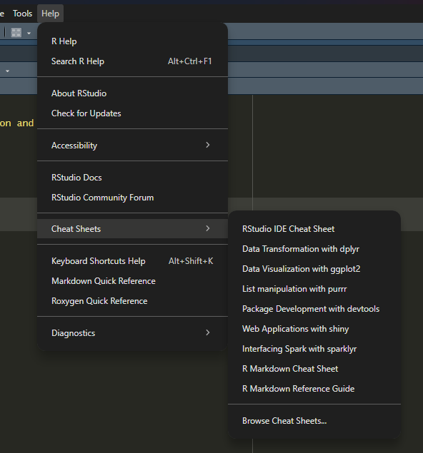

```{r setup, include=FALSE}
knitr::opts_chunk$set(echo = TRUE)
knitr::opts_chunk$set(fig.align='center', out.width = "85%")
```


## Need help? `R` help is helpful

```{r, echo = F, out.width="70%"}

```


## Get used to `PlainText` and `RMarkdown`, take notes with it!

- Avoid using word processors (like Google Docs or MS Word)

- better to think of the data and code as what’s real, together with the text you writ

- Idea: your figures, tables, and text, and so on, can be procedurally and reproducibly generated from code, data, and written material stored in a simple, plain-text format.

- Be proficient at juggling between **writing code**, **looking at output**, and **taking notes**

- A homework assignment to get your hands dirty

- About coding: R documentation/Google/StackExchange is your best friend. You can code *with* AI, but you should not be publishing code to production that you don't understand. 


## Graphics with `ggplot`

- A very nice graphical package in R is `ggplot2`
  - part of the `tidyverse`
  - makes beautiful plots out of *tidy* data
  - great flexibility


- There will be **quizzes** to assess your understanding of coding logic. 

- **tidy data** is key. `ggplot()` only ingests tidy `data.frame` and `tibble`. What is **tidy data**?
  - Each variable?
  - Each observation?
  - Each value?
  


## High-level syntax

- Plots are composed of **data** and **mapping**
  - **data**: tidy data
  - **mapping**: how variables are mapped to the aesthetic attributes
  
  
Components of **mapping**

- **Layers**: collections of geometric elements (`geom_`: what you see) and statistical transformations (`stats`: summaries of the data)

- **Scales**: map values (color, shape, size, etc...) in the data space to values in the aesthetic space. Note: `scale_` draws the legend and axes


## Example: `mpg` dataset

Type `?mpg` for the description

\tiny

```{r}
library(ggplot2)
head(mpg)
```


## Example: `mpg` dataset

Let's graphically explore this dataset using `ggplot2`:

- Start with loading the data
```{r}
g <- ggplot(data = mpg)
```

- Add in plot element with `+`. Here, `aes` is short for aesthetics. It says `x` coordinate corresponds to `displ`, and `y` corresponds to `hwy`
```{r, out.width="55%", fig.align='center'}
g + geom_point(aes(x = displ, y = hwy))
```


## Example: `mpg` dataset

- Maybe you don't want to use the whole dataset. 
```{r}
unique(mpg$class)
```

- We only want to load a subset of the dataset. In this case, we use the `subset()` function. The syntax is 
```
subset(.data, var_name %in% var_list)
```
It's very similar to the math expression $\mathrm{name} \in \{\text{list of names}\}$

```{r}
class_list = c("compact", "midsize", "subcompact", "suv")
g <- ggplot(
  data = subset(mpg, class %in% class_list)
)
```
\pause 
- If you just type `g` into the console, what do you get? What do you want to see?


## `mpg` dataset: adding points

We can add points using `geom_point()`

```{r, out.width="85%"}
g + geom_point(aes(x = displ, y = hwy))
```


## `mpg` dataset: distinguishing classes

In `aes`, we further specify `col` (stands for color) be according to the variable `class`

```{r, out.width="85%", fig.align='center'}
g + geom_point(aes(x = displ, y = hwy, col = class))
```


## General syntax for `geom_`

- Generally, the `ggplot2` templates look like
```
g <- ggplot(data = <DATA>) + geom_<FUNCTION>(mapping = aes(<AESTHETICS>)) + ...
```

- **Note with caution**: the `aes` can be put in ``ggplot`` or in the individual `geom_`, but they may mean different things (gets tricky fast)

- Try out yourself: is 
```
ggplot(data = mpg, aes(x = displ, y = hwy)) + geom_point() 
```
and 
```
ggplot(data = mpg) + geom_point(aes(x = displ, y = hwy))
```
produce the same thing?


## `mpg` dataset


Suppose I want to increase the size of the points to 3. Which one should I do?

```
g + geom_point(
  aes(x = displ, y = hwy, col = class, size = 3)
  )
```

vs

```
g + geom_point(
  aes(x = displ, y = hwy, col = class), 
  size = 3
)
```


## `mpg` dataset

```{r, out.width="80%"}
g + geom_point(
  aes(x = displ, y = hwy, col = class), size = 3
)
```


## `mpg` dataset, shape vs color


```{r, out.width="75%"}
g + geom_point(
  aes(x = displ, y = hwy, shape = class), size = 3
)
```

Note that both have limits when the class size is big. See `?shape`.

## `mpg` dataset

Say we are happy with the plots, what else do we need to adjust? \pause

\centering
**\textcolor{red}{LEGENDS AND LABELS!!!!}**


```{r, out.width="75%"}
g_final <- g + geom_point(
  aes(x = displ, y = hwy, col = class), 
  size = 3) + 
  labs(
    x = "Displacement",
    y = "Highway MPG",
    title = "Highway Mileage vs Engine Displacement",
    caption = "Source: mpg dataset"
  ) + 
  theme_bw()
```

\flushleft
\small


## `mpg` dataset

```{r, out.width="75%", fig.align='center'}
g_final
```

Note that the legends for `class` could be better, but we will come back to it. Legends could be fairly tricky. 


## High-level graphics grammar

- Plots are composed of **data** and **mapping**
  - **data**: tidy data
  - **mapping**: how variables are mapped to the aesthetic attributes
  
- New mapping component: `labs()` specify the labels

- New mapping component: `theme_<ThemeName>()` controls the finer points of display, font, font size, BG color, etc...


## Digression: `theme_`

- Note that we changed the background color by using the `theme_bw()` command

- Other commond themes:
  - `theme_minimal()`: grid without axes
  - `theme_classic()`: grid with axes
  - `theme_void()`: *nothing*
  - `theme_dark()`: the darker inner self of `theme_bw()`
  
  
- You could expand your theme selection by installing `ggthemes`.


## Example of themes

```{r, out.width="75%", fig.align='center'}
g_final + theme_dark()
```

Observe that `g_final()` already has a theme layer, but adding another layer will void the previous one. 

## Examples of `ggthemes`


```{r, out.width="75%", fig.align='center'}
g_final + ggthemes::theme_economist()
```

## Examples of `ggthemes`

```{r, out.width="75%", fig.align='center'}
g_final + ggthemes::theme_tufte()
```


## Back to `mpg` dataset

Suppose we use shapes for classes and colors for manufacture years. 

```{r, out.width="70%", fig.align='center'}
ggplot(data = subset(mpg, class %in% class_list)) +
  geom_point(aes(x = displ, y = hwy, shape = class, col = year), 
  size = 3)
```
What went wrong?


## Factors

- `class(mpg$year)` reveals that the `year` is a integer (numeric) vector, so `ggplot` treats it as a continuous scale. But for us, it should be a **categorical variable** (there are only two years, checked using `unique(mpg$year)`)

- One way to fix this is to convert `year` to `chr`, but maybe not desirable. Why?

- The other way is to convert numbers to categories (called *factors*) on the spot using `as.factor(year)`


## Factors


```{r, out.width="75%", fig.align='center'}
ggplot(data = subset(mpg, class %in% class_list)) +
  geom_point(aes(x = displ, y = hwy, 
                 shape = class, col = as.factor(year)), 
  size = 3)
```

## More on Factors

- In R, class labels like `drv` from `mpg` are captured by the **factor** class of objects

- **Factors**: Labeled observations with pre-defined set of labels (some of which may not occur)


- Note: Factor entries printed without quotes; are stored as a set of codes (NOT characters), and an attribute giving the levels

## More on Factors

```{r}
party <- c("Wizard", "Paladin", "Wizard", "Warlock")
prof <- factor(party)
class(prof)
typeof(prof)
```
- `?typeof`: internal storage mode for R
- `?class`: property assigned to an object so that other functions know how to deal wit it
- Here is the rabbit hole on [StackOverflow](https://stackoverflow.com/questions/35445112/what-is-the-difference-between-mode-and-class-in-r)

## More on Factors

Note: factors are stored as **integers** (not as characters), and a attribute givng the levels

```{r}
unclass(prof)
attr(prof, "levels")

```
```{r}
prof <- factor(party, 
  levels = c("Wizard", "Paladin", "Warlock", "Druid"))
prof
```


## More on Factors

You can convert a list to a different type of list (possibly with error) using `as.factor()`, `as.numeric()`, or `as.character`.

\small
```{r}
x <- c(1,1,2,3,5,2,1,4,2,3)
x2 <- as.numeric(x)
y <- as.factor(x)
z <- as.character(x)
```
```{r}
x - x2
```


```{r}
y-z
```


## Back to `mpg`

```{r, out.width="75%"}
g <- ggplot(mpg, aes(x = displ, y = cty)) + 
  geom_point(aes(color = as.factor(year)), size = 3)
g
```

## Fixing the legends

In `labs()`, we further specify the texts for the `color` attributes. Labeling can be tricky at first...more on this in a bit


```{r, out.width="75%", fig.align='center'}
g + 
  labs(x = "Displacement", y = "City MPG", 
       color = "Year")
```

## Summary: `geom_point()`


Plotting options for `geom_point` include:

- **shape**: duh

- **alpha**: transparency

- **size**: duh

- **color**: duh

\centering
**REMEMBER, SOMETIMES LESS IS MORE**


## Things can get overwhelming easily

```{r, out.width="65%"}
g_mess <- ggplot(mpg, aes(x = displ, y = cty)) + 
  geom_point(aes(
    shape = manufacturer,
    color = class,
    size = cyl
  ))
```

## Things can get overwhelming visually

\tiny
```{r, out.width="60%"}
g_mess
```

## Gapminder

Let's look at the `gapminder` dataset. First install the `gapminder` package, then load `dplyr` and `gapminder`. 

```{r, echo=F, include = F}
library(gapminder)
library(dplyr)
```


\tiny
```{r, size = 'small'}
slice_sample(gapminder, n = 5)
```

\tiny
```{r, size = 'tiny'}
str(gapminder)
```

## Mindfulness with elements

\tiny
```{r, out.width="65%", fig.align='center'}
g_gap <- ggplot(
  data = subset(gapminder, continent %in% c("Asia", "Americas")),
  aes(x = gdpPercap, y = lifeExp)) + 
  geom_point(aes(size = pop), color = "blue") + 
  coord_cartesian()+
  ggthemes::theme_economist_white() 
g_gap + annotate("rect", xmin = -100, xmax = 10000,ymin = 30, ymax = 75, color = "red", fill = NA, linewidth = 1) + annotate("text",x = 25000, y = 45,label = "Concentrated log growth",color = "red", size = 5)
```
## Mindfulness with elements

```{r, out.width="75%", fig.align='center'}
g_gap + scale_x_log10()
```

Looks more spread out, but anything to fix?

## Mindfulness with elements
\tiny
```{r, out.width="85%"}
g_gap + scale_x_log10(labels = scales::dollar) + 
  labs(x = "log GDP per capital", y = "Life Expectancy", size = "Population",
       title = "Gapminder Data", caption = "Source: gapminder dataset")
```

## Mindfulness with elements


\tiny
```{r, out.width="60%"}
ggplot(
  data = subset(gapminder, continent %in% c("Asia", "Americas")),
  aes(x = gdpPercap, y = lifeExp)) + 
  geom_point(aes(size = pop, color = continent)) + 
  scale_x_log10(labels = scales::dollar) + 
  labs(x = "log GDP per capital", y = "Life Expectancy", size = "Population", color = "Continent",
       title = "Gapminder Data", caption = "Source: gapminder dataset") + 
  ggthemes::theme_fivethirtyeight()
```

\normalsize
Note that every assigned aesthetics (`x`, `y`, `size`, `color`) $\leftrightarrow$ (`gdpPercap`, `lifeExp`, `pop`, `continent`) needs an (adjusted) label!


## Adding Texts

\tiny

```{r, out.width="55%"}
df <- data.frame(x = c(8,4,2,6), y = c(5,7,1,3),
                 job = c("Wizard", "Paladin", "Druid", "Rogue"))
p <- ggplot(df, aes(x,y)) + ggthemes::theme_solarized() + xlim(0,10) + ylim(-2,10)
p + geom_label(aes(label = job), size = 8) + 
  theme(plot.title = element_text(size = 15)) + 
  ggtitle("Fun with with geom_text() \n as you wait for your turn") 
```

\small
- `theme(plot.title= element_text(size = 9))` shrinks the title
- You can use `geom_text()` in place of `geom_label()`. Try it, and read the documentation!


## Adding Texts

\tiny 

```{r, out.width="55%"}
p + geom_text(aes(label = job), size = 10, 
              nudge_x = 0.6, nudge_y = 0.4) + 
  geom_point(size = 3, color = 'purple') + 
  ggtitle("Fun with with geom_text() \n as you wait for your turn") 
```
\small

- `nudge_x` and `nudge_y` provides horizontal and vertical adjustment to nudge labels by
- Good for adding companion texts to data points


## Common `geom_` functions

- `geom_bar(stat = "identity")` makes a **bar chart**

- `geom_line()` makes a **line plot**

- `geom_errorbar()` adds **error bar** (important when conveying uncertainty!)

- `geom_smooth` adds smoothed conditional means with 95% CI

- Type in `geom` in the Help panel for others


## Adding lines with `oecd_le`

We will use the `oecd_le` dataset. 

**Exercise:** load the `socviz` library, look at `oecd_le` dataset, then use `ggplot()` to load the data corresponding to **Mexico**, and set the overall aesthetics so that $x$-axis is the Year and $y$-axis is the Life Expectancy. Add in labels and use your favorite themes.

\pause


```{r}
library(socviz)
p <- ggplot(
  data = subset(oecd_le, country %in% c("Mexico")),
  mapping = aes(x = year, y = lifeexp)) + 
  labs(x = "Year", y = "Life Expectancy", caption = "Source: OECD", title = "Life Expectancy in Mexico") +
  ggthemes::theme_stata()
```


## Adding lines with `oecd_le`

```{r, out.width="75%"}
p + geom_line(linewidth = 1.5, linetype= "4413", color = 'darkgreen') + 
  ggtitle("Life Expectancy in Mexico")
```

- Note the string of numbers in `linetype`. Look up what it means by typing `?shape`


## Adding lines

**Exercise:** type `unqiue(oecd_le$country)` to see the list of countries in the dataset. Pick four of interest. Form a new dataset called `fav4` and load it into ``ggplot`` and form a graph object `p`, and set the global aesthetics as before.

\pause

\tiny
```{r}
fav4_list <- c("Chile", "Ireland", "Mexico", "Greece")
fav4 <- subset(oecd_le, country %in% fav4_list)
p <- ggplot(fav4, aes(
  x = year, y = lifeexp))
```


## Adding lines

Let's plot the lines. Each one should correspond to a country. 

\tiny
```{r}
p + geom_line(aes(color = country, linetype = country), linewidth = 1.5) +
  labs(x = "Year", y = "Life Expectancy", title = "Life Expectancy", caption = "Source: OECD")
```

## Adding lines, delicate choice

Sometimes, `geom_line()` does not behave the way we think, and it is not the best choice for showing "trend"

\tiny

```{r}
library(gapminder)
ggplot(subset(gapminder, continent %in% c("Asia")), 
       aes(x = gdpPercap, y = lifeExp)) + geom_line()
```


## `geom_bar()`

Some `geom_` does statistics for you (by transforming the data)!

\tiny
```{r}
library(socviz)
p <- ggplot(
  data = subset(gss_sm, partyid != "NA"),
  mapping = aes(x = partyid)
) 
p + geom_bar() + 
  theme(axis.text.x = element_text(angle = 45, vjust = 0.7))
```

## `geom_bar()`

```{r, out.width="70%"}
p + geom_bar(aes(fill = bigregion)) + 
  theme(axis.text.x = element_text(angle = 45, vjust = 0.7))
```
- In `geom_bar`, `fill` is an aesthetic element that controls the interior filling of each rectangle

##

```{r, out.width="70%"}
p + geom_bar(aes(fill = bigregion), position = "fill") + 
  theme(axis.text.x = element_text(angle = 45, vjust = 0.7))
```
- What should the $y$-axis be now? Fix all the labels. 
- Look up `geom_bar` for more on `position`


## `position` in `geom_bar`


- Common settings for `position` include "fill", "stack", "dodge", and "jitter". Below is the example for "dodge" (oftentimes the best)


```{r, out.width="70%", echo = F}
p + geom_bar(aes(fill = bigregion), position = "dodge") + 
  theme(axis.text.x = element_text(angle = 45, vjust = 0.7))
```


## Comments on `geom_bar`

\begin{columns}

\column{0.5\textwidth}


\begin{itemize}

\item `dodge` works better, especially with multi-facted plots (more later)

\item  Easier to read long labels horizontally, so \texttt{+ coord\_flip()}. 

\item Saves us the trouble of rotating and making presentation more effective


\end{itemize}


\column{0.6\textwidth}

\tiny
```{r, out.width="100%", echo = F}
p + geom_bar(aes(fill = bigregion), position = "dodge") + 
  coord_flip() + 
  labs(
    x = "Number of Survey Participants", 
    y = "Party Affiliation",
    title = "Party affiliation according to regions",
    caption = "Source: General Social Survey data, 2016"
  )
```


\end{columns}

## What's next?

- We will look at what these data transformations are. Data transformation is also synonymous with **data wrangling** (a better word for your resume)

- Detour into *`R` for Data Science* available for free here: <https://r4ds.hadley.nz/>


